# KS Signalschirme

## Mehrabschnitssignal

<table>
  <thead>
    <tr>
      <th colspan="2">Vorschau</th>
      <th>Besonderheiten</th>
      <th>Dateien</th>
    </tr>
  </thead>
  <tbody>
    <tr>
      <td width="200"></td>
      <td width="200">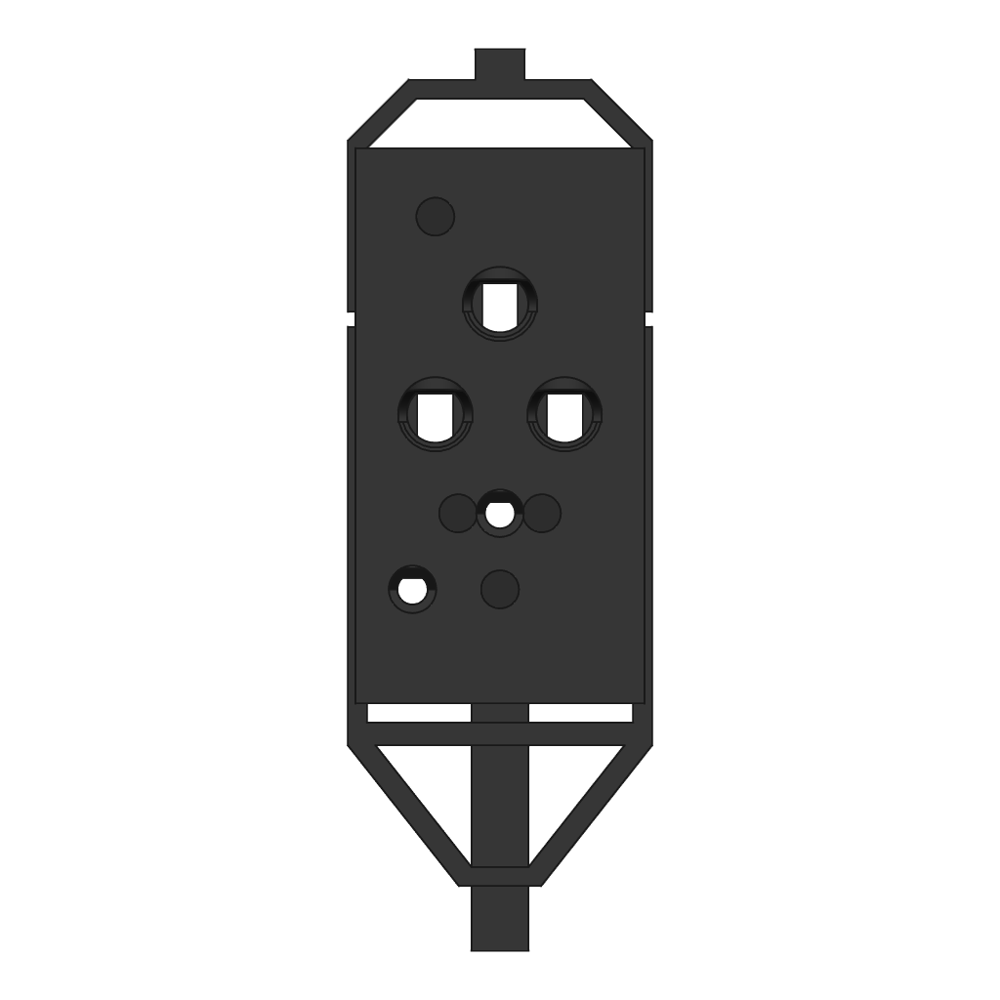</td>
      <td>
        <ul>
          <li>Rangiersignal (Sh1)</li>
          <li>Ersatzsignal (im Sh1)</li>
        </ul>
      </td>
      <td>
        <a href="export/MS_Sh1.stl">STL</a> 
        <a href="export/MS_Zs_Sh1.stl">STL&nbsp;(Zs&nbsp;oben)</a> 
        <a href="export/MS_Sh1.step">STEP</a> 
        <a href="export/MS_Zs_Sh1.step">STEP&nbsp;(Zs&nbsp;oben)</a> 
      </td>
    </tr>
    <tr>
      <td>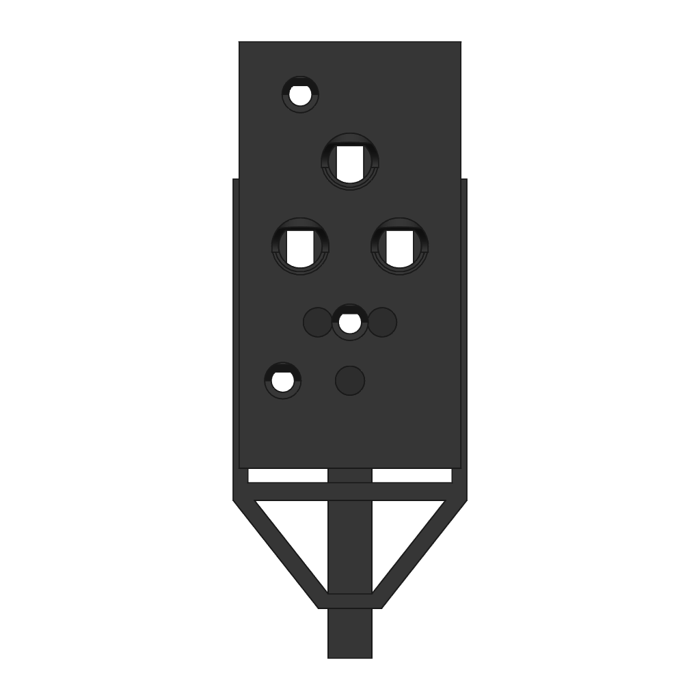</td>
      <td>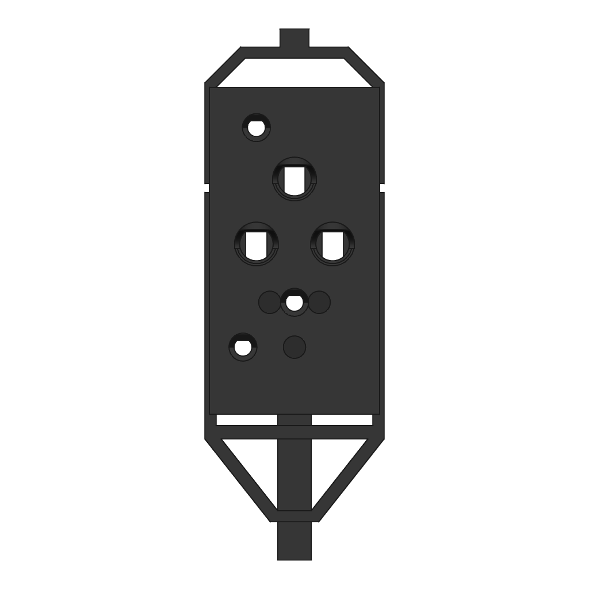</td>
      <td>
        <ul>
          <li>Kennlicht</li>
          <li>Rangiersignal (Sh1)</li>
          <li>Ersatzsignal (im Sh1)</li>
          <li>Verkürzter Bremswegabstand</li>
        </ul>
      </td>
      <td>
        <a href="export/MS_Sh1_vkBw.stl">STL</a> 
        <a href="export/MS_Zs_Sh1_vkBw.stl">STL&nbsp;(Zs&nbsp;oben)</a> 
        <a href="export/MS_Sh1_vkBw.step">STEP</a> 
        <a href="export/MS_Zs_Sh1_vkBw.step">STEP&nbsp;(Zs&nbsp;oben)</a> 
      </td>
    </tr>
    <tr>
      <td></td>
      <td>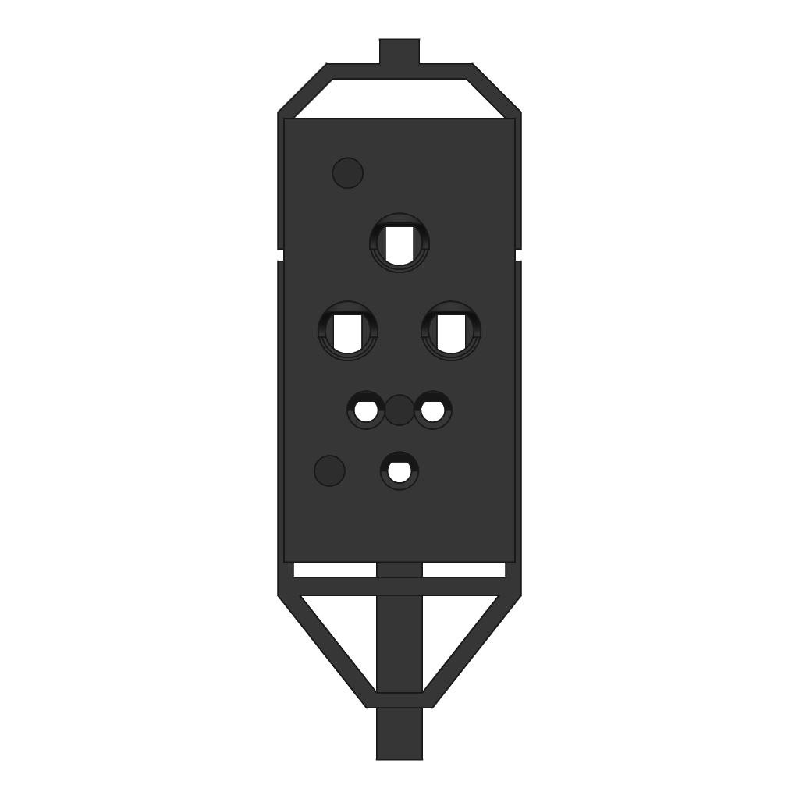</td>
      <td>
        <ul>
          <li>Vorsichtssignal (Zs7)</li>
        </ul>
      </td>
      <td>
        <a href="export/MS_Zs7.stl">STL</a> 
        <a href="export/MS_Zs_Zs7.stl">STL&nbsp;(Zs&nbsp;oben)</a> 
        <a href="export/MS_Zs7.step">STEP</a> 
        <a href="export/MS_Zs_Zs7.step">STEP&nbsp;(Zs&nbsp;oben)</a> 
      </td>
    </tr>
    <tr>
      <td>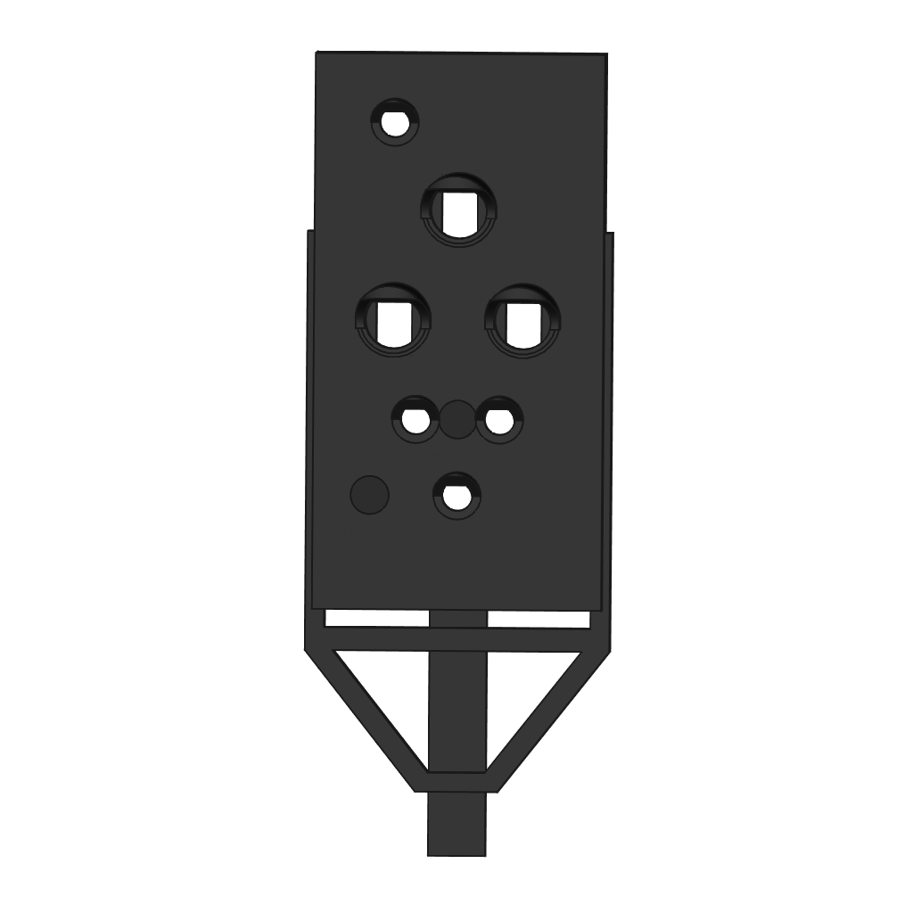</td>
      <td>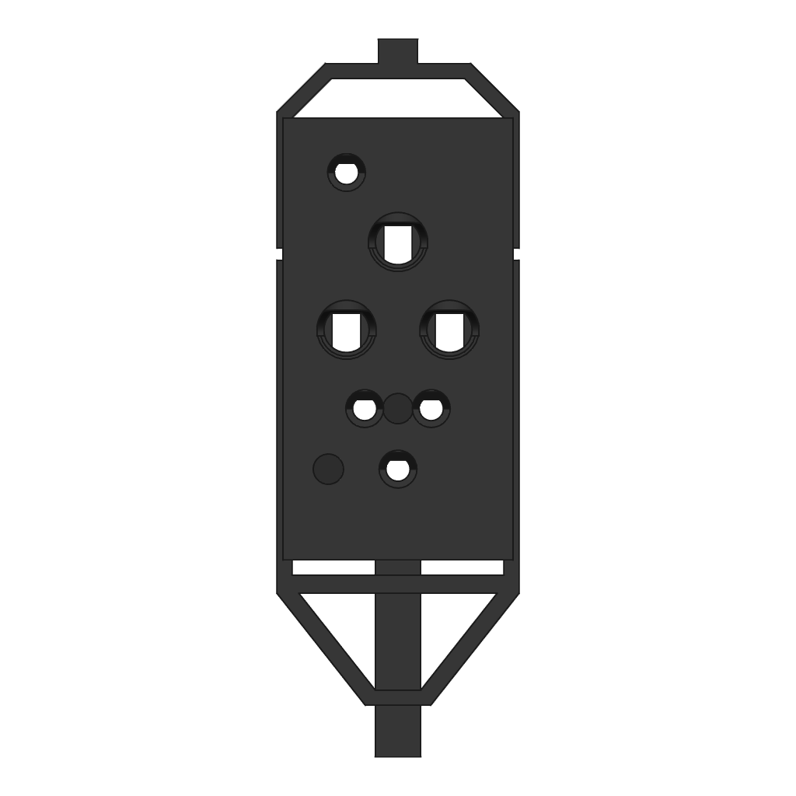</td>
      <td>
        <ul>
          <li>Kennlicht</li>
          <li>Vorsichtssignal (Zs7)</li>
          <li>Verkürzter Bremswegabstand</li>
        </ul>
      </td>
      <td>
        <a href="export/MS_Zs7_vkBw.stl">STL</a> 
        <a href="export/MS_Zs_Zs7_vkBw.stl">STL&nbsp;(Zs&nbsp;oben)</a> 
        <a href="export/MS_Zs7_vkBw.step">STEP</a> 
        <a href="export/MS_Zs_Zs7_vkBw.step">STEP&nbsp;(Zs&nbsp;oben)</a> 
      </td>
    </tr>
    <tr>
      <td>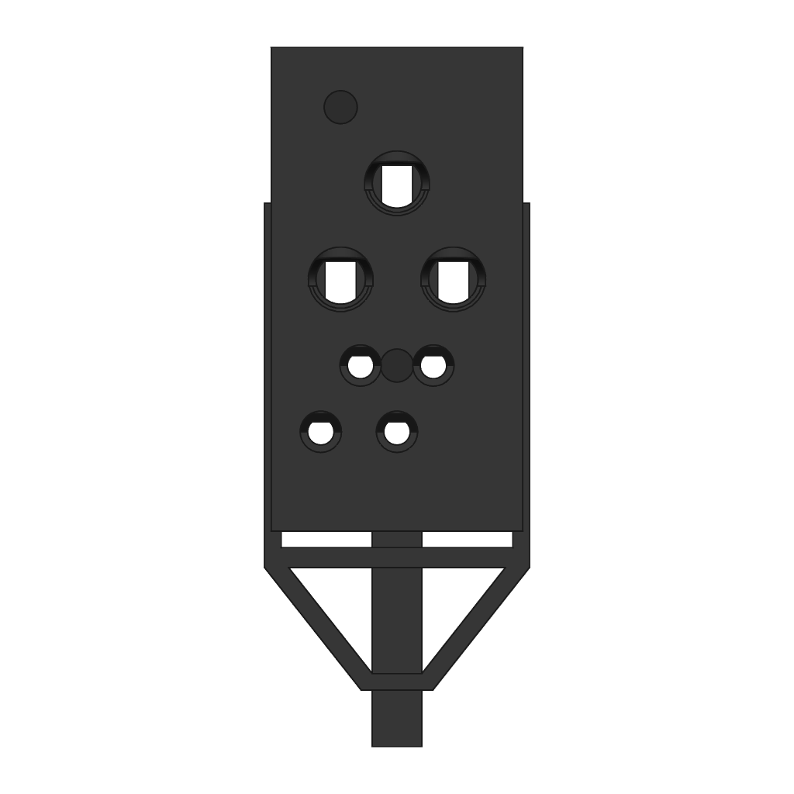</td>
      <td>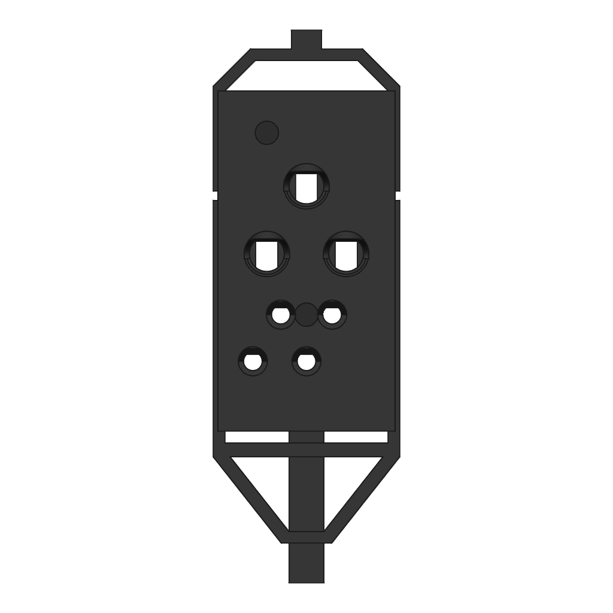</td>
      <td>
        <ul>
          <li>Vorsichtssignal</li>
          <li>Ersatzsignal (links)</li>
        </ul>
      </td>
      <td>
        <a href="export/MS_Zs7_Zs1.stl">STL</a> 
        <a href="export/MS_Zs_Zs7_Zs1.stl">STL&nbsp;(Zs&nbsp;oben)</a> 
        <a href="export/MS_Zs7_Zs1.step">STEP</a> 
        <a href="export/MS_Zs_Zs7_Zs1.step">STEP&nbsp;(Zs&nbsp;oben)</a> 
      </td>
    </tr>
    <tr>
      <td>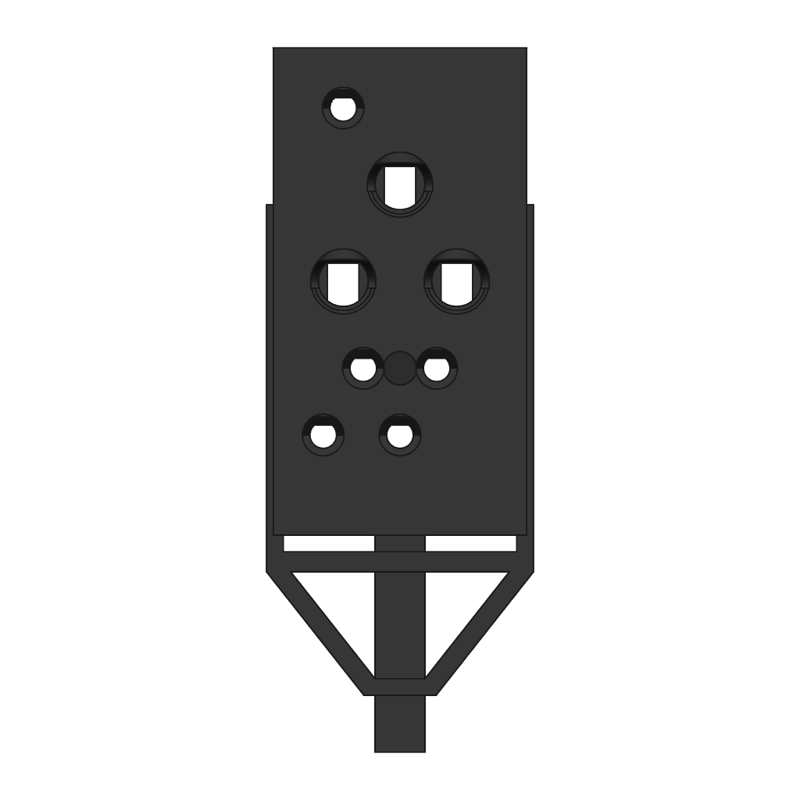</td>
      <td>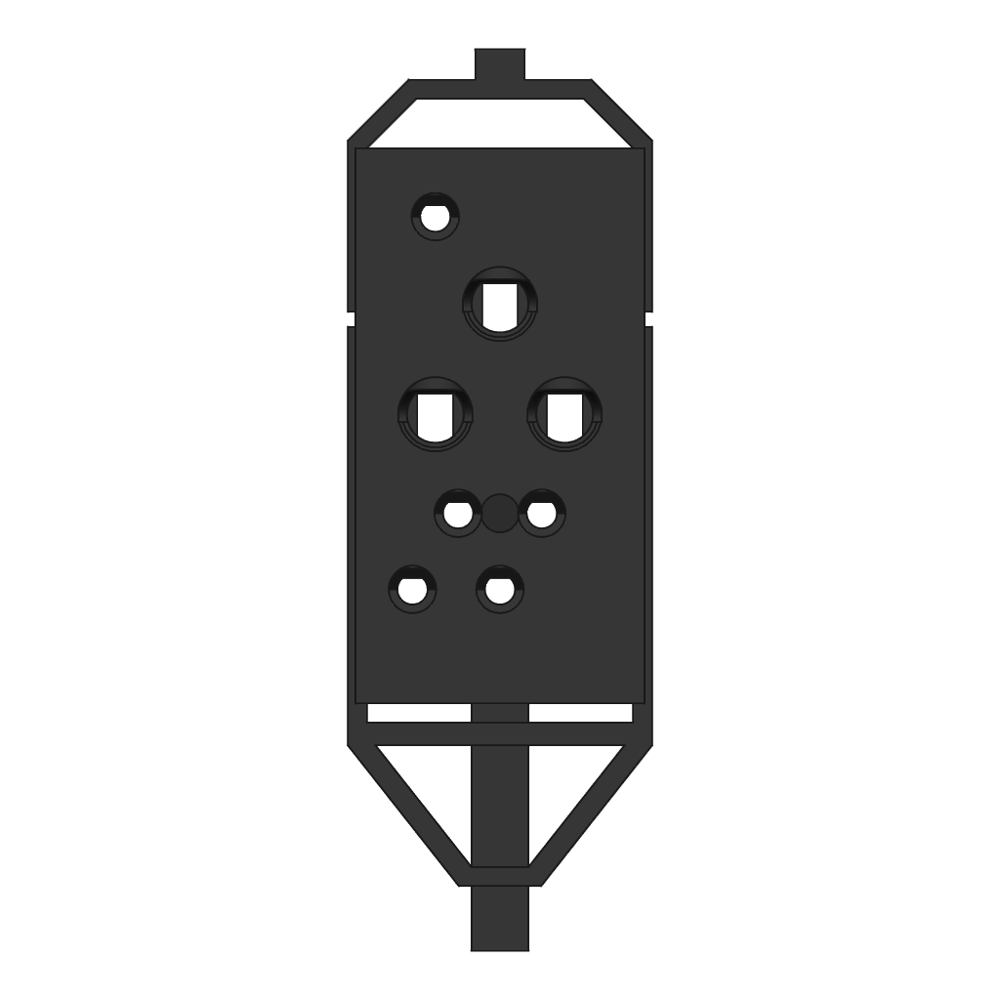</td>
      <td>
        <ul>
          <li>Kennlicht</li>
          <li>Vorsichtssignal</li>
          <li>Ersatzsignal (links)</li>
          <li>Verkürzter Bremswegabstand</li>
        </ul>
      </td>
      <td>
        <a href="export/MS_Zs7_Zs1_vkBw.stl">STL</a> 
        <a href="export/MS_Zs_Zs7_Zs1_vkBw.stl">STL&nbsp;(Zs&nbsp;oben)</a> 
        <a href="export/MS_Zs7_Zs1_vkBw.step">STEP</a> 
        <a href="export/MS_Zs_Zs7_Zs1_vkBw.step">STEP&nbsp;(Zs&nbsp;oben)</a> 
      </td>
    </tr>
    <tr>
      <td>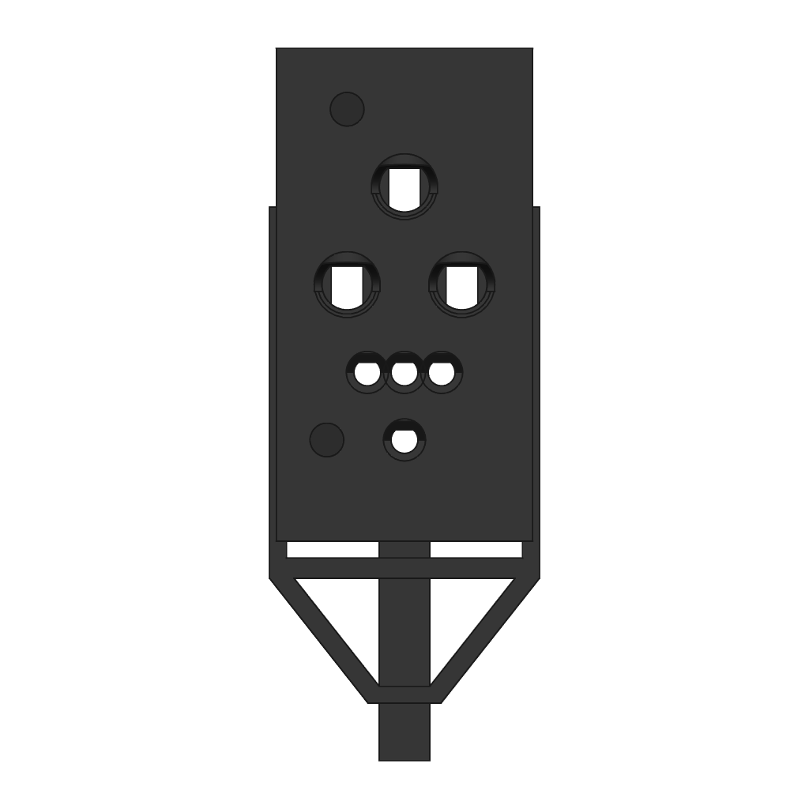</td>
      <td></td>
      <td>
        <ul>
          <li>Vorsichtssignal</li>
          <li>Ersatzsignal (mittig)</li>
        </ul>
      </td>
      <td>
        <a href="export/MS_Zs7_Zs1m.stl">STL</a> 
        <a href="export/MS_Zs_Zs7_Zs1m.stl">STL&nbsp;(Zs&nbsp;oben)</a> 
        <a href="export/MS_Zs7_Zs1m.step">STEP</a> 
        <a href="export/MS_Zs_Zs7_Zs1m.step">STEP&nbsp;(Zs&nbsp;oben)</a> 
      </td>
    </tr>
    <tr>
      <td></td>
      <td></td>
      <td>
        <ul>
          <li>Kennlicht</li>
          <li>Vorsichtssignal</li>
          <li>Ersatzsignal (mittig)</li>
          <li>Verkürzter Bremswegabstand</li>
        </ul>
      </td>
      <td>
        <a href="export/MS_Zs7_Zs1m_vkBw.stl">STL</a> 
        <a href="export/MS_Zs_Zs7_Zs1m_vkBw.stl">STL&nbsp;(Zs&nbsp;oben)</a> 
        <a href="export/MS_Zs7_Zs1m_vkBw.step">STEP</a> 
        <a href="export/MS_Zs_Zs7_Zs1m_vkBw.step">STEP&nbsp;(Zs&nbsp;oben)</a> 
      </td>
    </tr>
    <tr>
      <td></td>
      <td>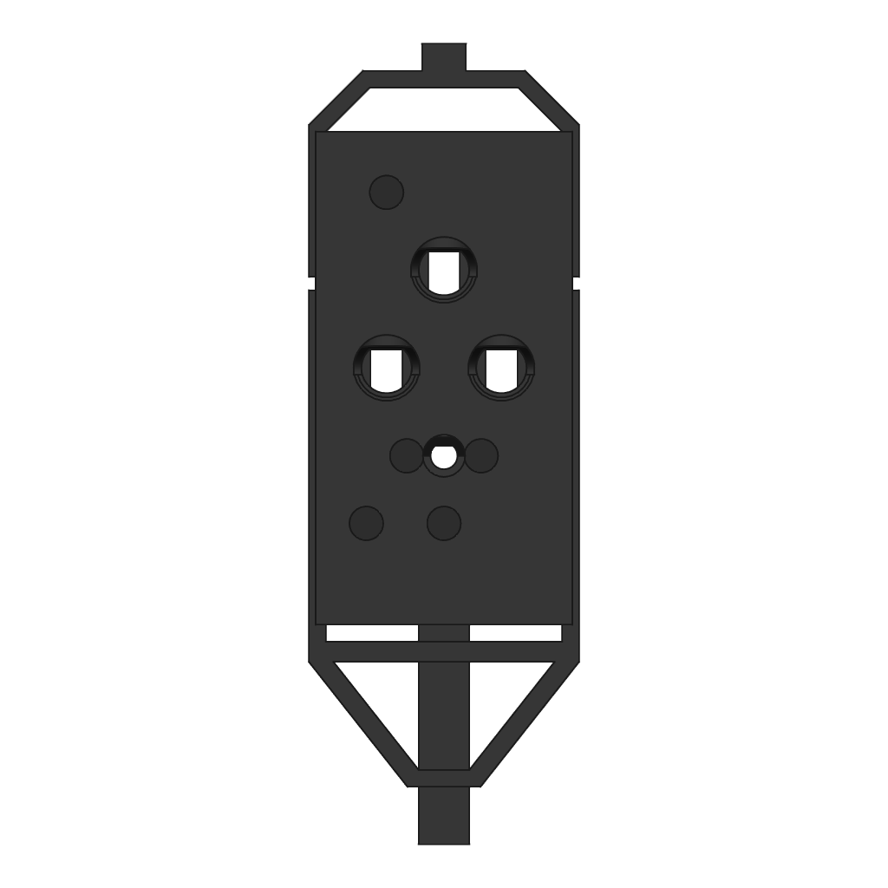</td>
      <td>
        <ul>
          <li>Ersatzsignal</li>
        </ul>
      </td>
      <td>
        <a href="export/MS_Zs1.stl">STL</a> 
        <a href="export/MS_Zs_Zs1.stl">STL&nbsp;(Zs&nbsp;oben)</a> 
        <a href="export/MS_Zs1.step">STEP</a> 
        <a href="export/MS_Zs_Zs1.step">STEP&nbsp;(Zs&nbsp;oben)</a> 
      </td>
    </tr>
    <tr>
      <td></td>
      <td>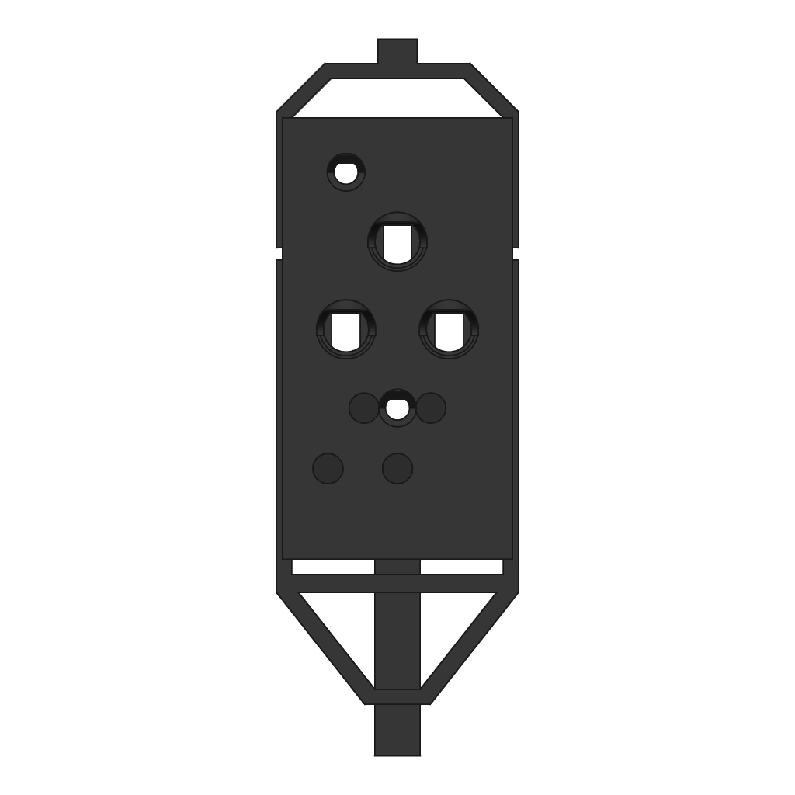</td>
      <td>
        <ul>
          <li>Kennlicht</li>
          <li>Ersatzsignal</li>
          <li>Verkürzter Bremswegabstand</li>
        </ul>
      </td>
      <td>
        <a href="export/MS_Zs1_vkBw.stl">STL</a> 
        <a href="export/MS_Zs_Zs1_vkBw.stl">STL&nbsp;(Zs&nbsp;oben)</a> 
        <a href="export/MS_Zs1_vkBw.step">STEP</a> 
        <a href="export/MS_Zs_Zs1_vkBw.step">STEP&nbsp;(Zs&nbsp;oben)</a> 
      </td>
    </tr>
  </tbody>
</table>

## Vorsignal

<table>
  <thead>
    <tr>
      <th width="180">Vorschau</th>
      <th>Besonderheiten</th>
      <th>Dateien</th>
    </tr>
  </thead>
  <tbody>
    <tr>
      <td ></td>
      <td></td>
      <td>
        <a href="export/VS_Vsig.stl">STL</a> 
        <a href="export/VS_Vsig.step">STEP</a> 
      </td>
    </tr>
    <tr>
      <td ></td>
      <td>
        <ul>
          <li>Wiederholer</li>
        </ul>
      </td>
      <td>
        <a href="export/VS_Vsig_Wd.stl">STL</a> 
        <a href="export/VS_Vsig_Wd.step">STEP</a> 
      </td>
    </tr>
    <tr>
      <td >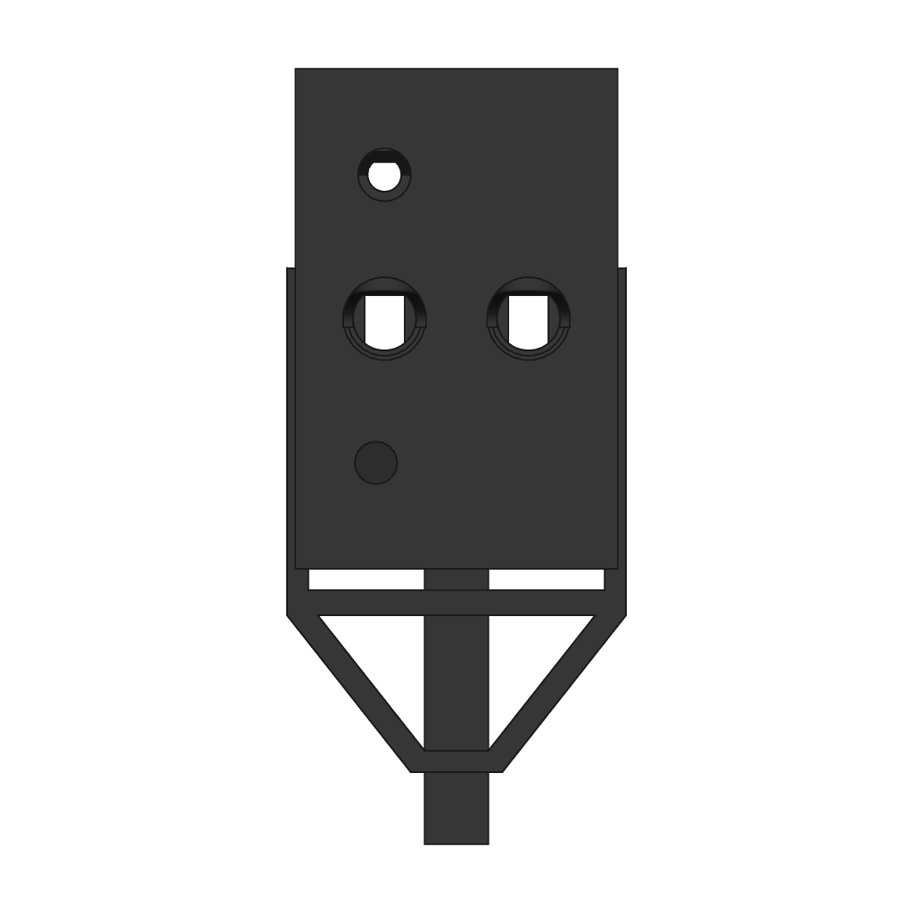</td>
      <td>
        <ul>
          <li>Verkürzter Bremswegabstand</li>
        </ul>
      </td>
      <td>
        <a href="export/VS_Vsig_vkBw.stl">STL</a> 
        <a href="export/VS_Vsig_vkBw.step">STEP</a> 
      </td>
    </tr>
  </tbody>
</table>
