# Signalschirme

## Mehrabschnitssignale

<table width="100%">
  <thead>
    <tr>
      <th colspan="2">Vorschau</th>
      <th>Anmerkungen</th>
    </tr>
  </thead>
  <tbody>
    <tr>
      <td width="200" align="center"></td>
      <td width="200" align="center">
        
         
        <a href="export/MS__B.step">STEP</a> · <a href="export/MS__B.stl">STL</a>
      </td>
      <td></td>
    </tr>
    <tr>
      <td width="200" align="center"></td>
      <td width="200" align="center">
        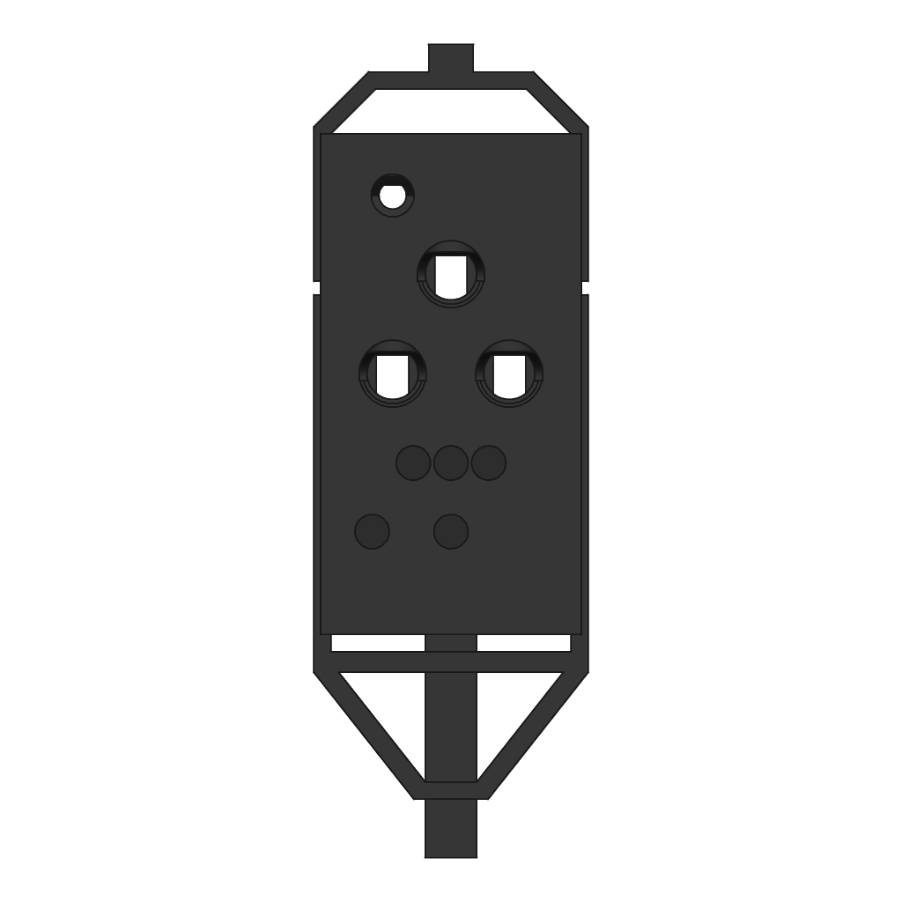
         
        <a href="export/MS_vBw__B.step">STEP</a> · <a href="export/MS_vBw__B.stl">STL</a>
      </td>
      <td>
        <ul>
          <li>Kennlicht</li>
          <li>Verkürzter Bremswegabstand</li>
        </ul>
      </td>
    </tr>
    <tr>
      <td width="200" align="center">
        
         
        <a href="export/MS_Sh1__A.step">STEP</a> · <a href="export/MS_Sh1__A.stl">STL</a>
      </td>
      <td width="200" align="center">
        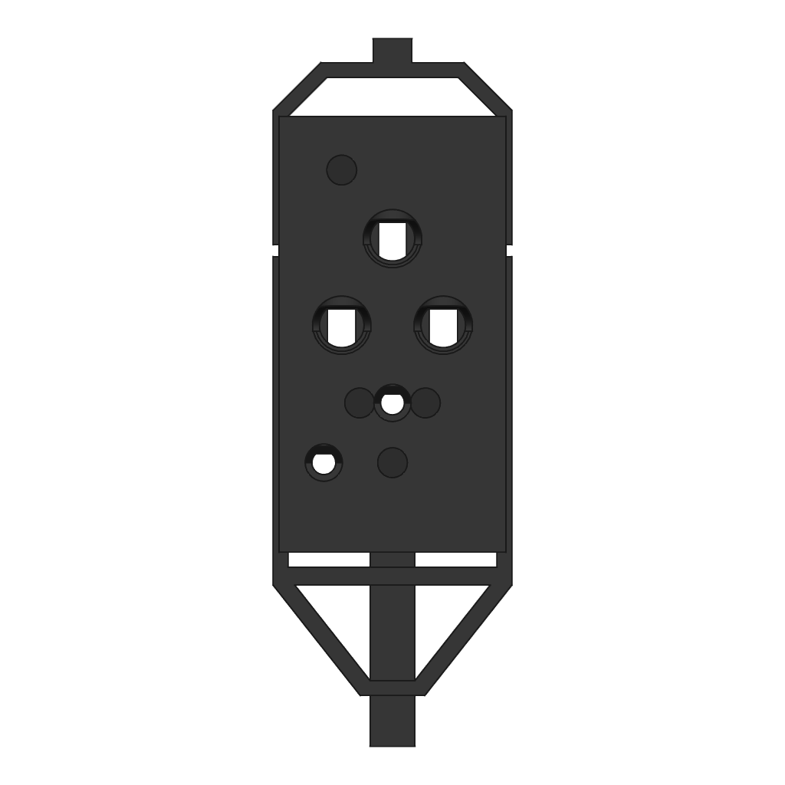
         
        <a href="export/MS_Sh1__B.step">STEP</a> · <a href="export/MS_Sh1__B.stl">STL</a>
      </td>
      <td>
        <ul>
          <li>Rangiersignal</li>
          <li>Ersatzsignal</li>
        </ul>
      </td>
    </tr>
    <tr>
      <td width="200" align="center">
        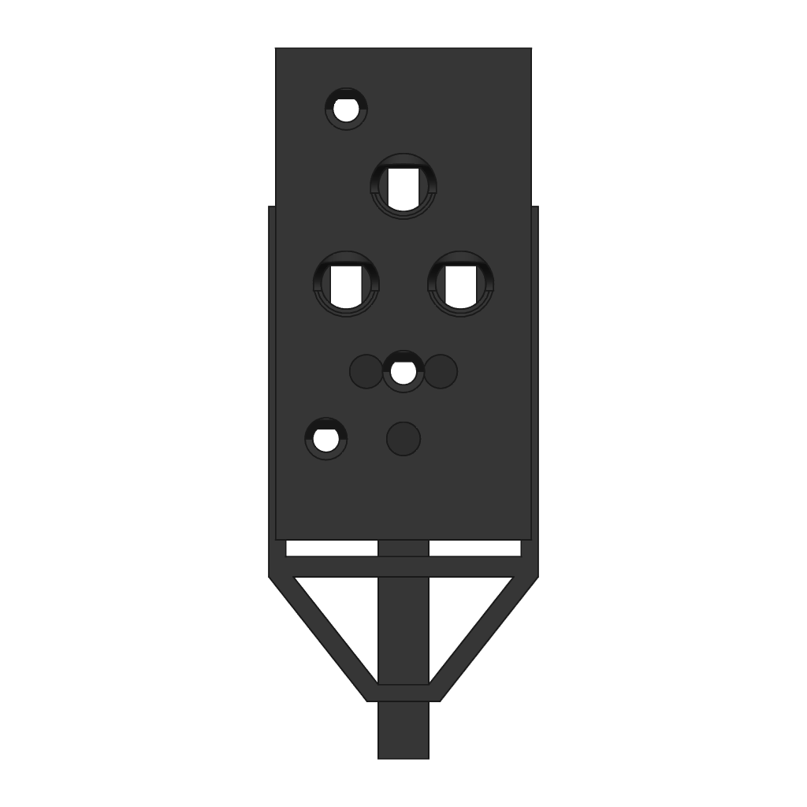
         
        <a href="export/MS_Sh1_vBw__A.step">STEP</a> · <a href="export/MS_Sh1_vBw__A.stl">STL</a>
      </td>
      <td width="200" align="center">
        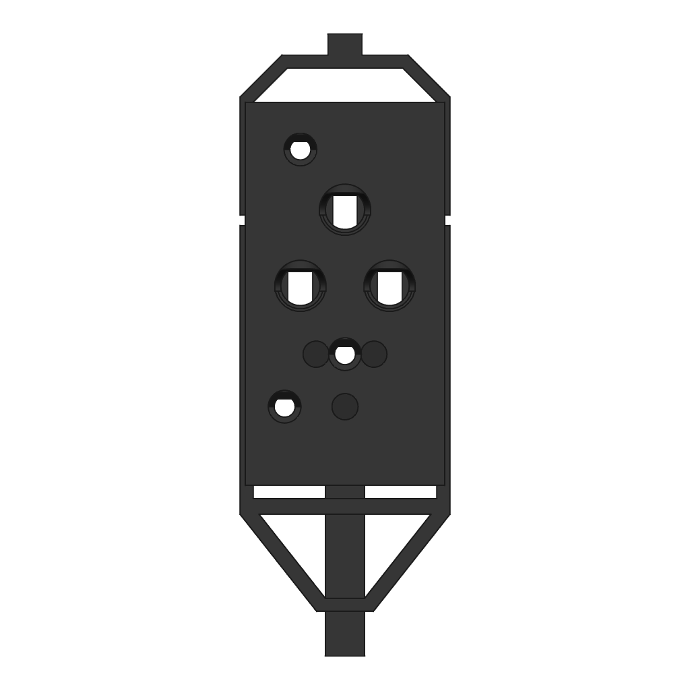
         
        <a href="export/MS_Sh1_vBw__B.step">STEP</a> · <a href="export/MS_Sh1_vBw__B.stl">STL</a>
      </td>
      <td>
        <ul>
          <li>Kennlicht</li>
          <li>Rangiersignal</li>
          <li>Ersatzsignal</li>
          <li>Verkürzter Bremswegabstand</li>
        </ul>
      </td>
    </tr>
    <tr>
      <td width="200" align="center">
        
         
        <a href="export/MS_Zs1__A.step">STEP</a> · <a href="export/MS_Zs1__A.stl">STL</a>
      </td>
      <td width="200" align="center">
        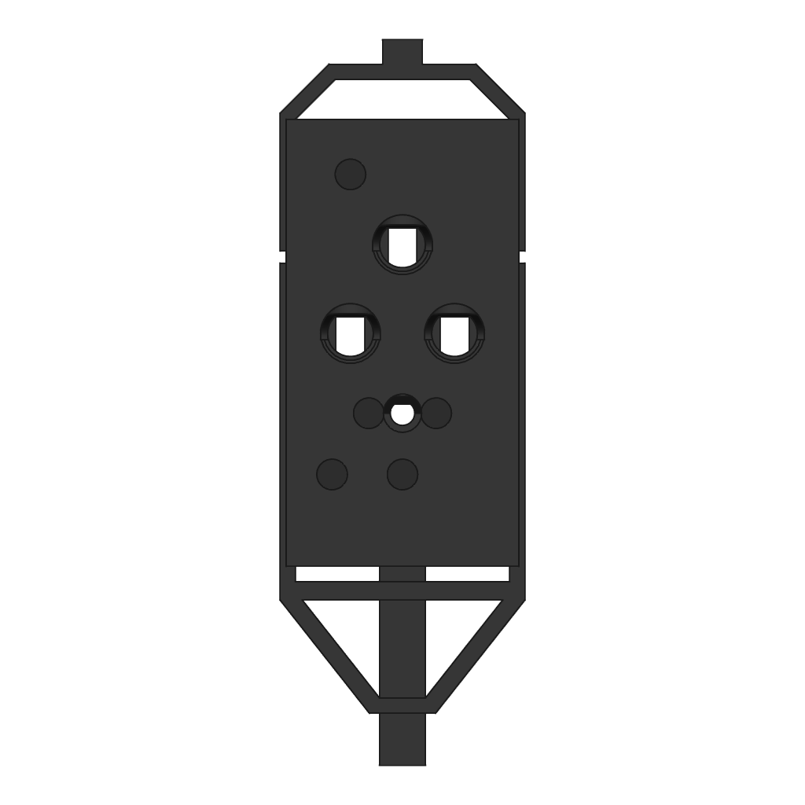
         
        <a href="export/MS_Zs1__B.step">STEP</a> · <a href="export/MS_Zs1__B.stl">STL</a>
      </td>
      <td>
        <ul>
          <li>Ersatzsignal</li>
        </ul>
      </td>
    </tr>
    <tr>
      <td width="200" align="center">
        
         
        <a href="export/MS_Zs1_vBw__A.step">STEP</a> · <a href="export/MS_Zs1_vBw__A.stl">STL</a>
      </td>
      <td width="200" align="center">
        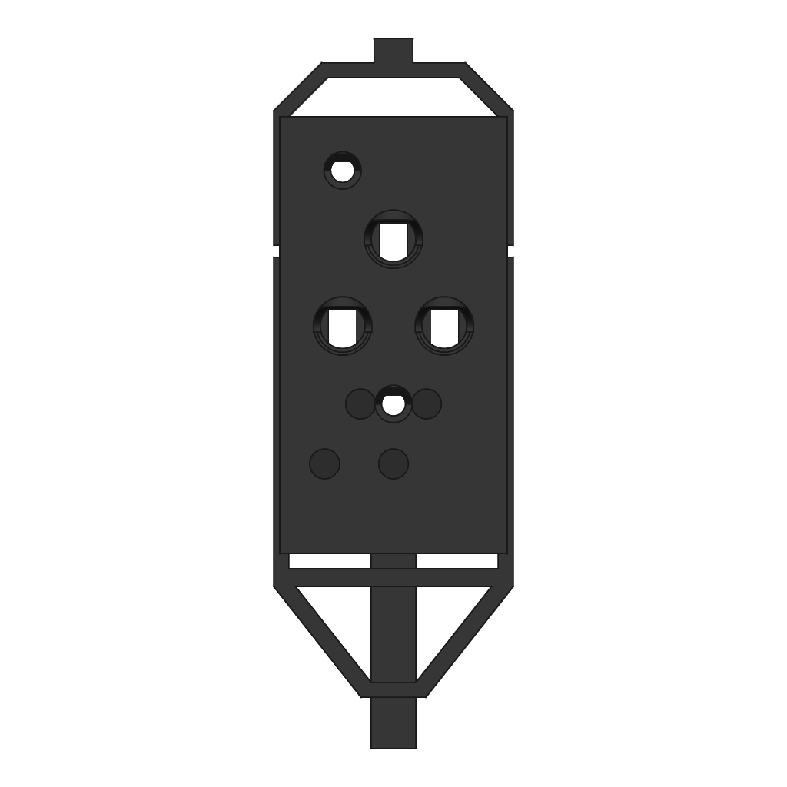
         
        <a href="export/MS_Zs1_vBw__B.step">STEP</a> · <a href="export/MS_Zs1_vBw__B.stl">STL</a>
      </td>
      <td>
        <ul>
          <li>Kennlicht</li>
          <li>Ersatzsignal</li>
          <li>Verkürzter Bremswegabstand</li>
        </ul>
      </td>
    </tr>
    <tr>
      <td width="200" align="center">
        
         
        <a href="export/MS_Zs7__A.step">STEP</a> · <a href="export/MS_Zs7__A.stl">STL</a>
      </td>
      <td width="200" align="center">
        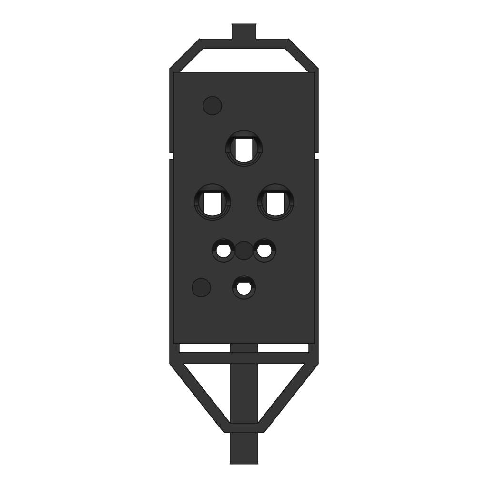
         
        <a href="export/MS_Zs7__B.step">STEP</a> · <a href="export/MS_Zs7__B.stl">STL</a>
      </td>
      <td>
        <ul>
          <li>Vorsichtssignal</li>
        </ul>
      </td>
    </tr>
    <tr>
      <td width="200" align="center">
        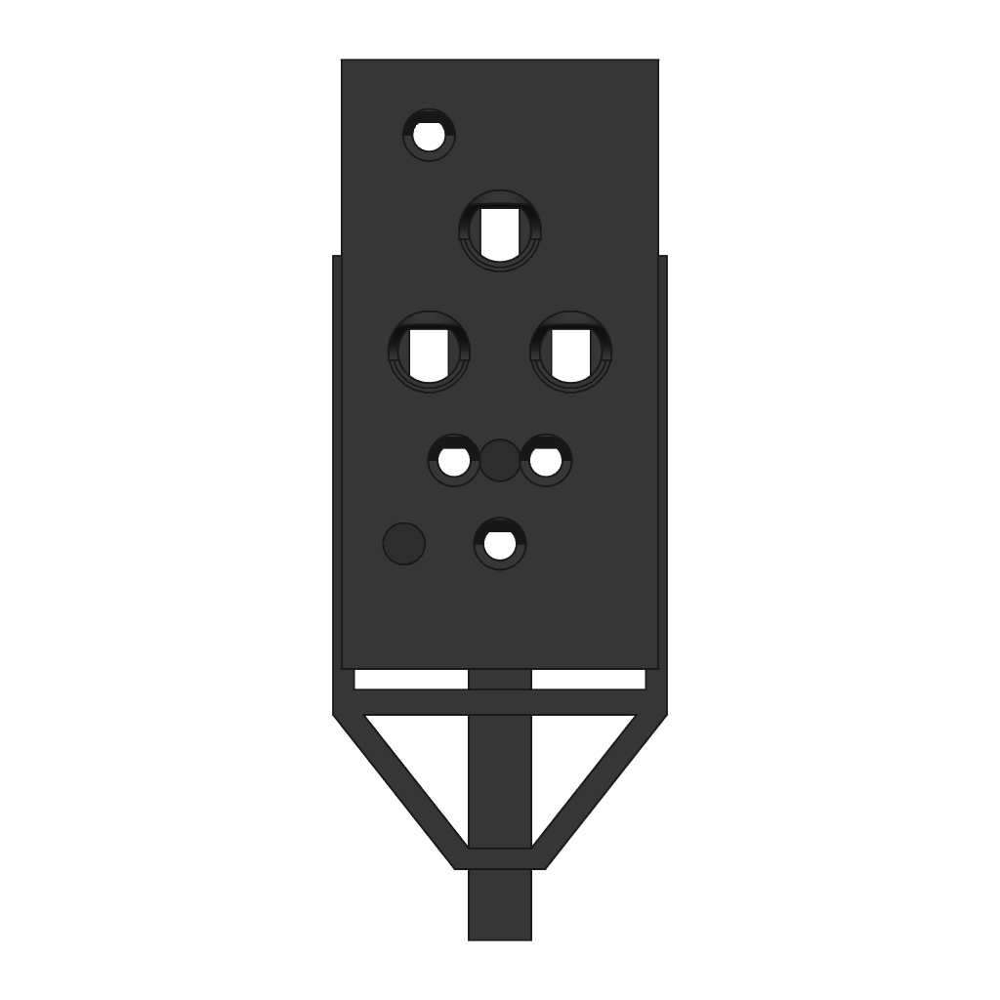
         
        <a href="export/MS_Zs7_vBw__A.step">STEP</a> · <a href="export/MS_Zs7_vBw__A.stl">STL</a>
      </td>
      <td width="200" align="center">
        
         
        <a href="export/MS_Zs7_vBw__B.step">STEP</a> · <a href="export/MS_Zs7_vBw__B.stl">STL</a>
      </td>
      <td>
        <ul>
          <li>Kennlicht</li>
          <li>Vorsichtssignal</li>
          <li>Verkürzter Bremswegabstand</li>
        </ul>
      </td>
    </tr>
    <tr>
      <td width="200" align="center">
        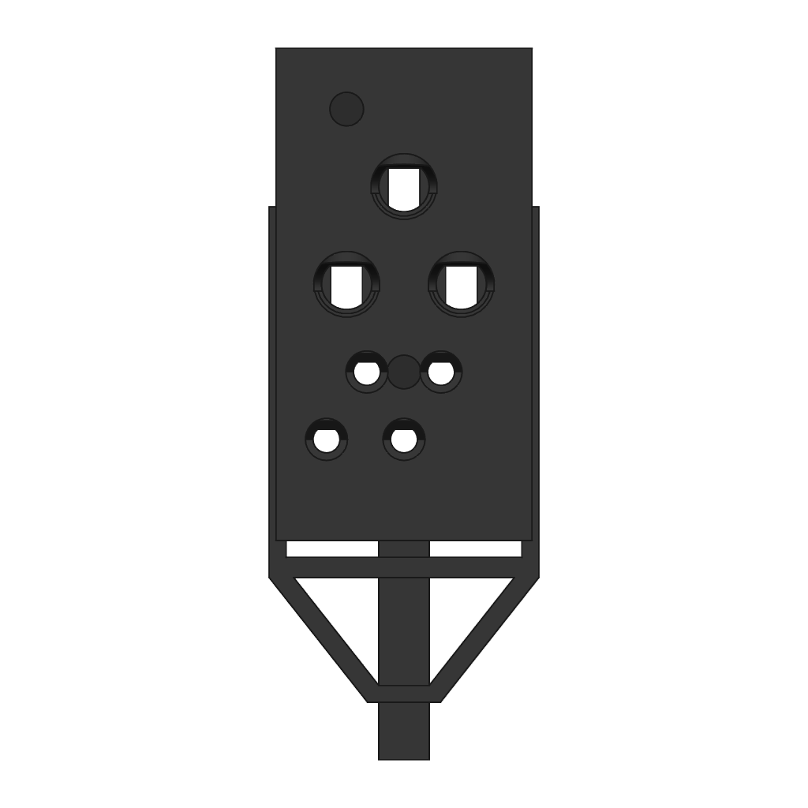
         
        <a href="export/MS_Zs7_Zs1__A.step">STEP</a> · <a href="export/MS_Zs7_Zs1__A.stl">STL</a>
      </td>
      <td width="200" align="center">
        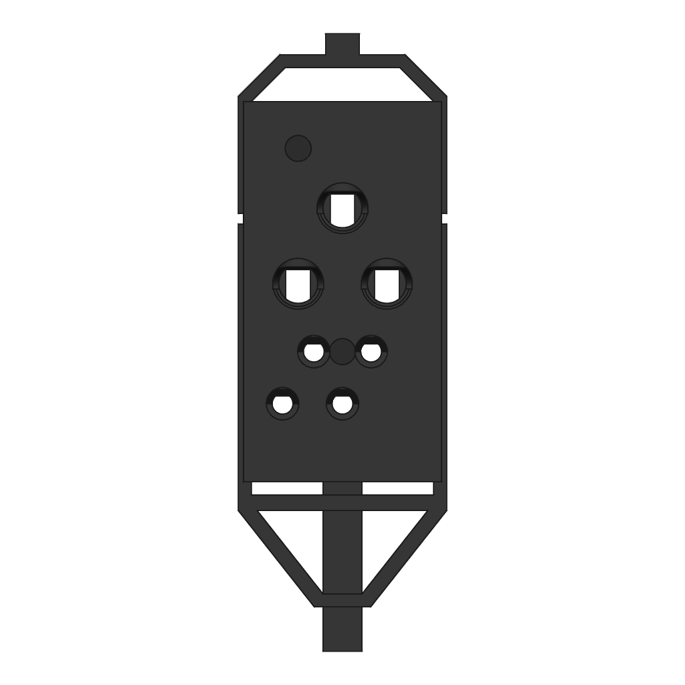
         
        <a href="export/MS_Zs7_Zs1__B.step">STEP</a> · <a href="export/MS_Zs7_Zs1__B.stl">STL</a>
      </td>
      <td>
        <ul>
          <li>Vorsichtssignal</li>
          <li>Ersatzsignal (links unten)</li>
        </ul>
      </td>
    </tr>
    <tr>
      <td width="200" align="center">
        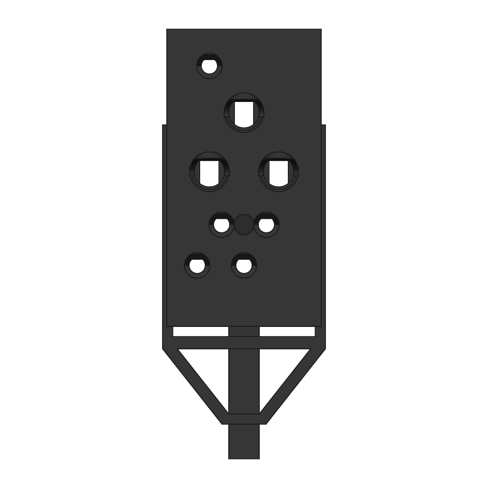
         
        <a href="export/MS_Zs7_Zs1_vBw__A.step">STEP</a> · <a href="export/MS_Zs7_Zs1_vBw__A.stl">STL</a>
      </td>
      <td width="200" align="center">
        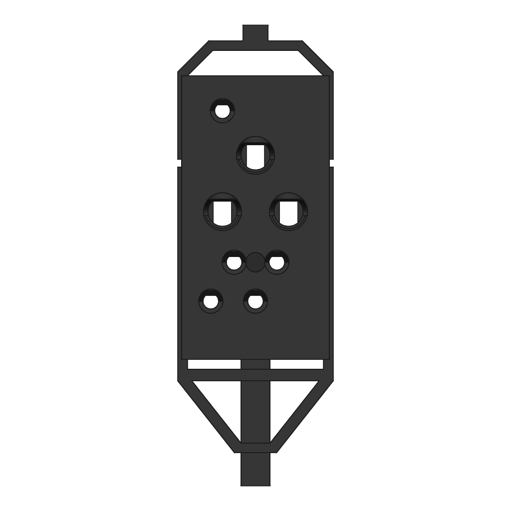
         
        <a href="export/MS_Zs7_Zs1_vBw__B.step">STEP</a> · <a href="export/MS_Zs7_Zs1_vBw__B.stl">STL</a>
      </td>
      <td>
        <ul>
          <li>Kennlicht</li>
          <li>Vorsichtssignal</li>
          <li>Ersatzsignal (links unten)</li>
          <li>Verkürzter Bremswegabstand</li>
        </ul>
      </td>
    </tr>
    <tr>
      <td width="200" align="center">
        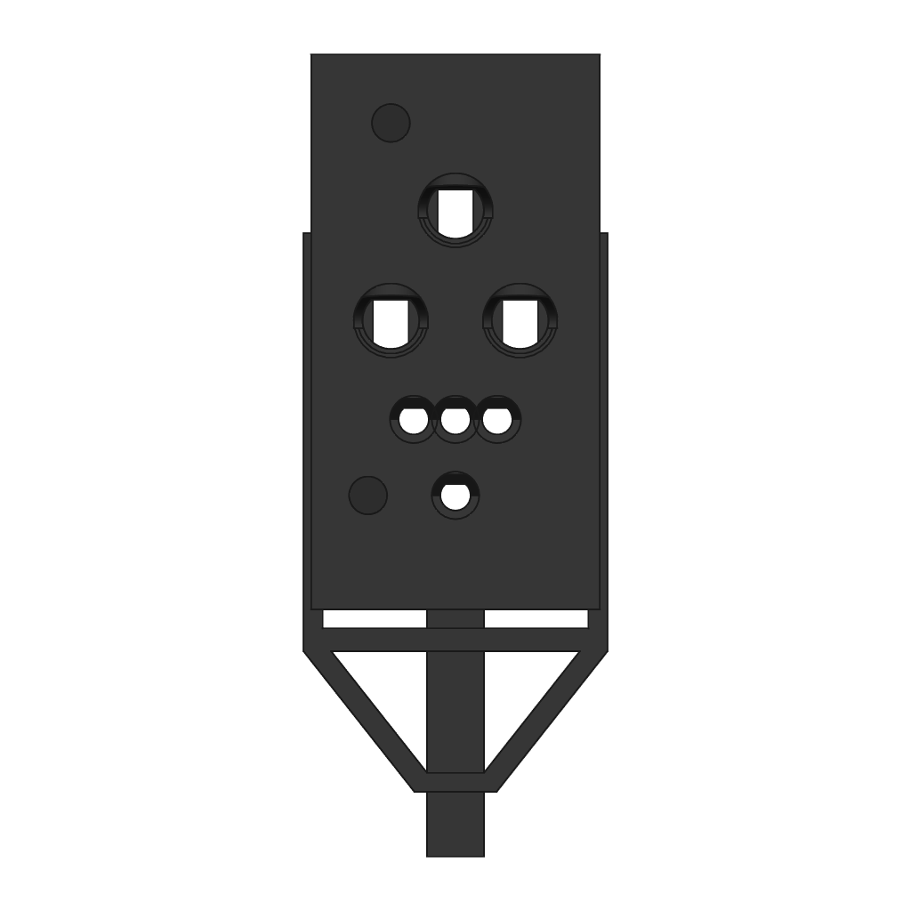
         
        <a href="export/MS_Zs7_Zs1m__A.step">STEP</a> · <a href="export/MS_Zs7_Zs1m__A.stl">STL</a>
      </td>
      <td width="200" align="center">
        
         
        <a href="export/MS_Zs7_Zs1m__B.step">STEP</a> · <a href="export/MS_Zs7_Zs1m__B.stl">STL</a>
      </td>
      <td>
        <ul>
          <li>Vorsichtssignal</li>
          <li>Ersatzsignal (mittig)</li>
        </ul>
      </td>
    </tr>
    <tr>
      <td width="200" align="center">
        
         
        <a href="export/MS_Zs7_Zs1m_vBw__A.step">STEP</a> · <a href="export/MS_Zs7_Zs1m_vBw__A.stl">STL</a>
      </td>
      <td width="200" align="center">
        
         
        <a href="export/MS_Zs7_Zs1m_vBw__B.step">STEP</a> · <a href="export/MS_Zs7_Zs1m_vBw__B.stl">STL</a>
      </td>
      <td>
        <ul>
          <li>Kennlicht</li>
          <li>Vorsichtssignal</li>
          <li>Ersatzsignal (mittig)</li>
          <li>Verkürzter Bremswegabstand</li>
        </ul>
      </td>
    </tr>
  </tbody>
</table>

## Vorsignale

<table width="100%">
  <thead>
    <tr>
      <th colspan="2">Vorschau</th>
      <th>Anmerkungen</th>
    </tr>
  </thead>
  <tbody>
    <tr>
      <td width="200" align="center">
        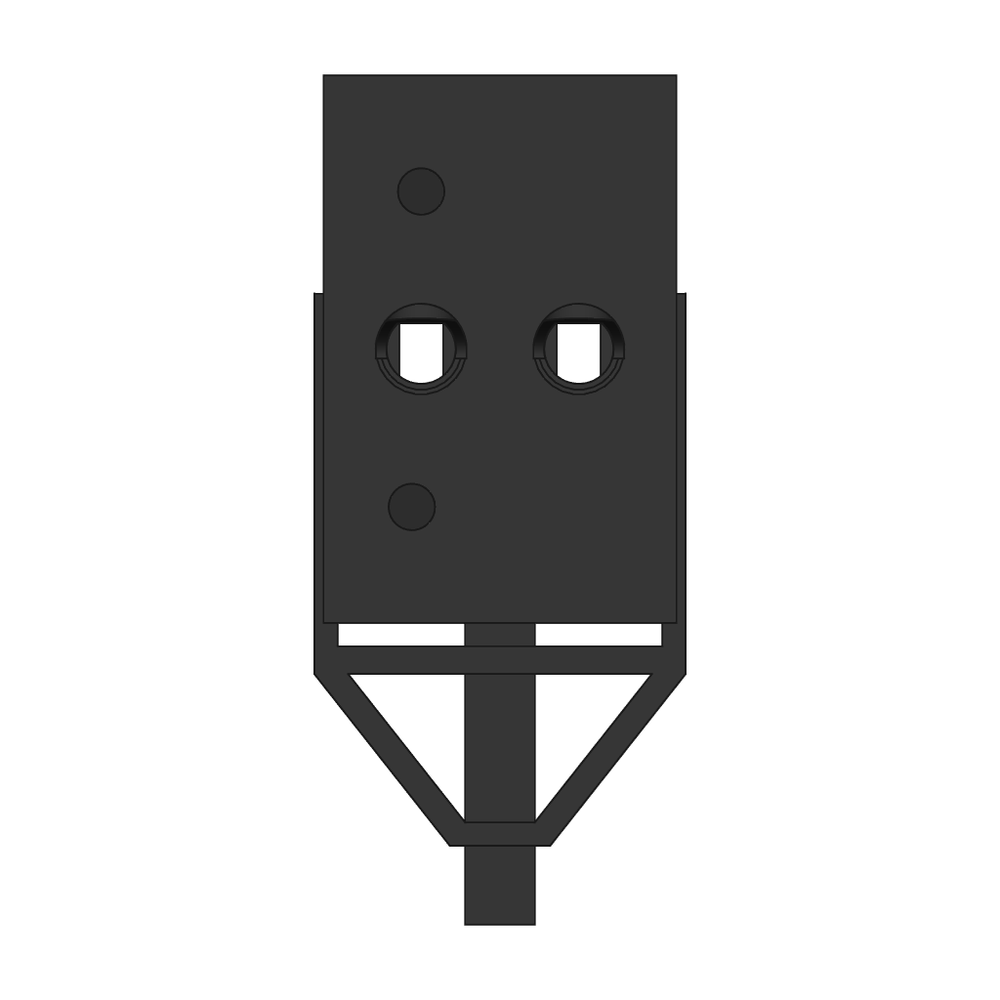
         
        <a href="export/VS_Vsig.step">STEP</a> · <a href="export/VS_Vsig.stl">STL</a>
      </td>
      <td width="200" align="center"></td>
      <td></td>
    </tr>
    <tr>
      <td width="200" align="center">
        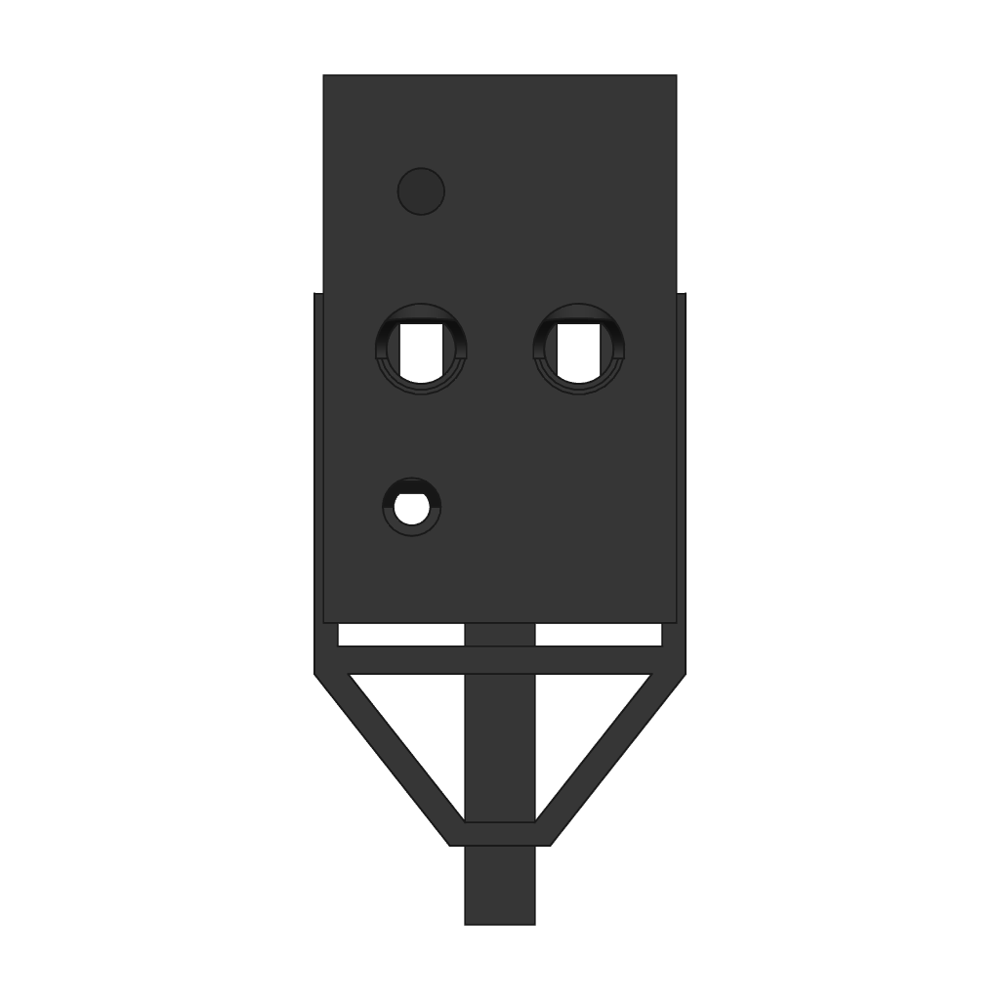
         
        <a href="export/VS_Vsig_Wd.step">STEP</a> · <a href="export/VS_Vsig_Wd.stl">STL</a>
      </td>
      <td width="200" align="center"></td>
      <td>
        <ul>
          <li>Wiederholer</li>
        </ul>
      </td>
    </tr>
    <tr>
      <td width="200" align="center">
        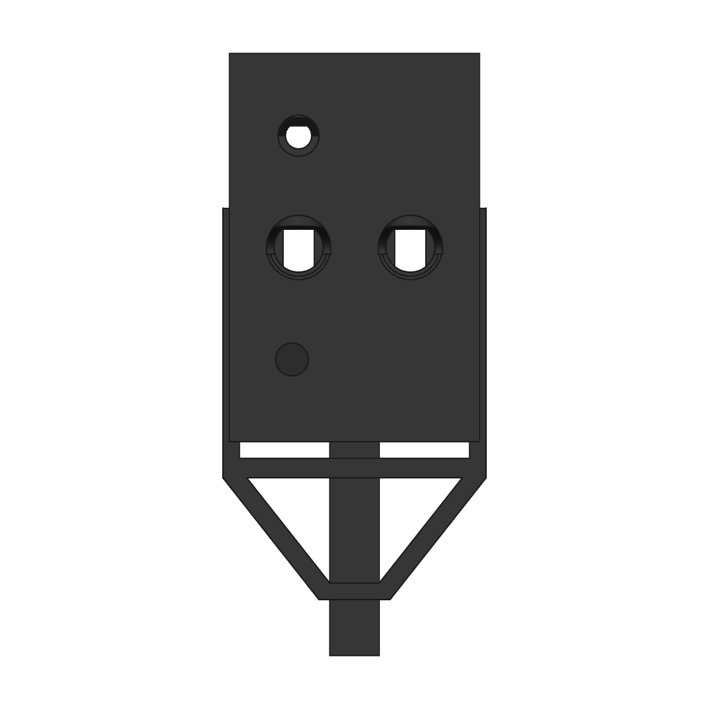
         
        <a href="export/VS_Vsig_vBw.step">STEP</a> · <a href="export/VS_Vsig_vBw.stl">STL</a>
      </td>
      <td width="200" align="center"></td>
      <td>
        <ul>
          <li>Verkürzter Bremswegabstand</li>
        </ul>
      </td>
    </tr>
  </tbody>
</table>
