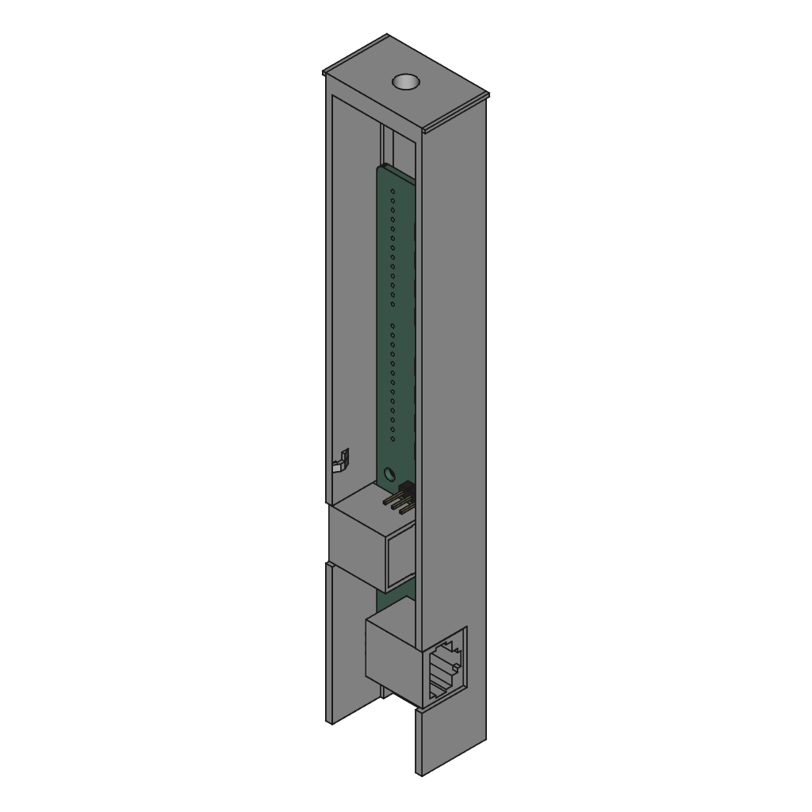
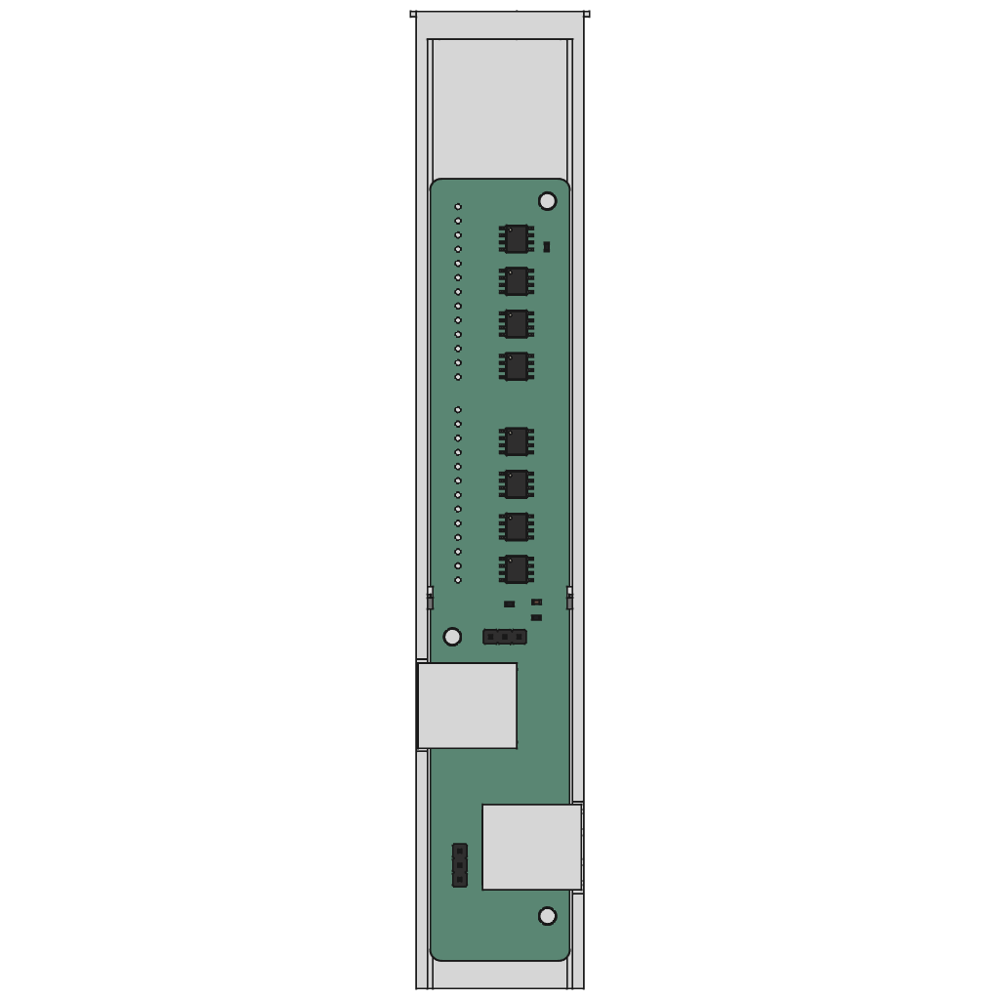
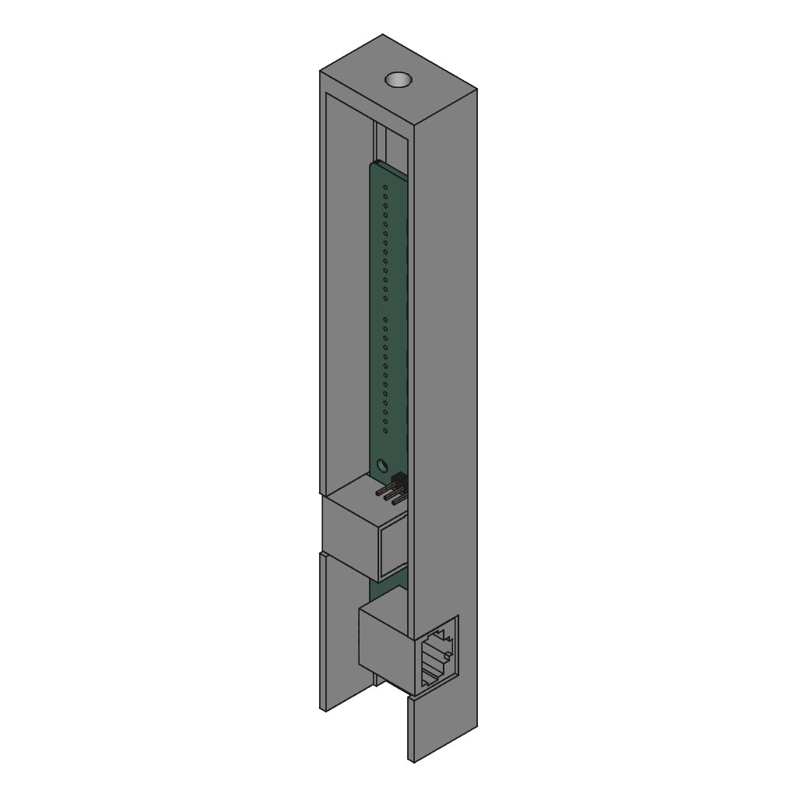
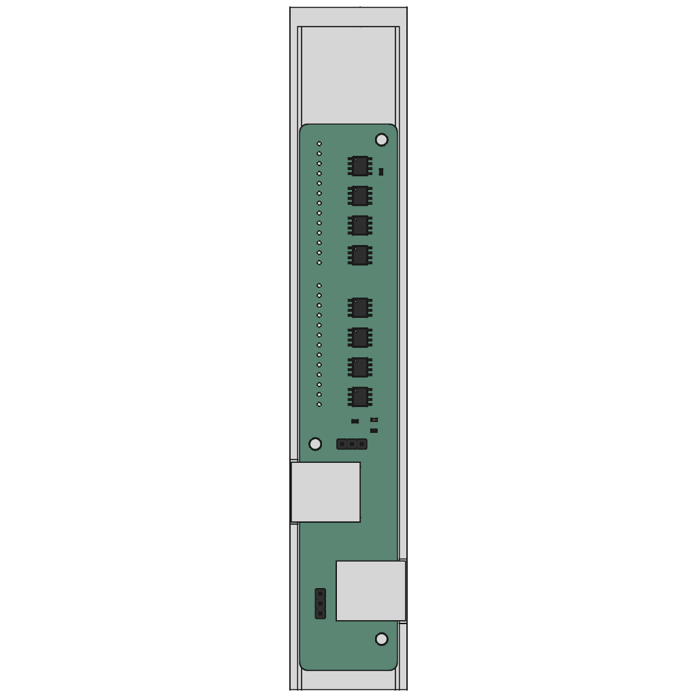

# Wattenscheider signal mounts

With M3 screw mounts for [WS8211 LED driver boards](../../kicad/extra/).

## With latch

Signal mount has a 1 mm latch on top to stop the module from falling through.

<table>
  <tbody>
    <tr>
      <td width="50%"></td>
      <td width="50%"></td>
    </tr>
  </tbody>
</table>

* [STL model file](export/watti-w-latch-assembly.stl)
* [STEP model file](export/watti-w-latch-assembly.step)

## Without latch

<table>
  <tbody>
    <tr>
      <td width="50%"></td>
      <td width="50%"></td>
    </tr>
  </tbody>
</table>

* [STL model file](export/watti-assembly.stl)
* [STEP model file](export/watti-assembly.step)

## License

This work is licensed under a
[Creative Commons Attribution-ShareAlike 4.0 International License](http://creativecommons.org/licenses/by-sa/4.0/).

