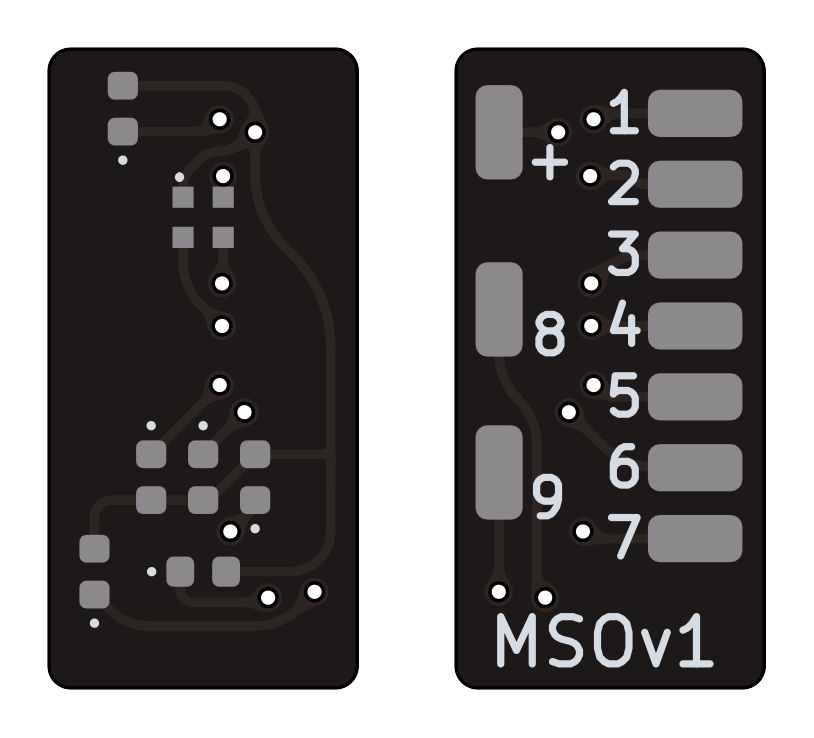
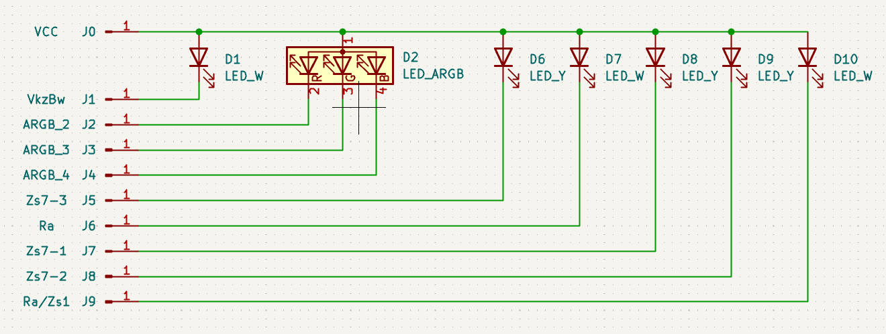
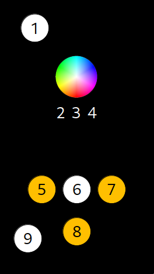

# Hauptsignal mit mehrfarbiger Optik MSOv1

Geeignet für KS-Hauptsignale und Mehrabschnitssignale mit mehrfarbiger Optik über eine ARGB-LED.

Pin 1 muss die gemeinsame Anode der RGB LED sein, die anderen Pins können je nach Bedarf Rot, Grün, oder Blau sein. Das ermöglicht auch den Einsatz auch von zum Beispiel ARGB und ARBG LEDs.

## Anschlussbelegung

| Schema                | Pin-Belegung                    |
| --------------------- | ------------------------------- |
|  |  |

| Referenz | Pin | LED      | Funktion                         |
| -------- | --- | -------- | -------------------------------- |
| J0       | +   |          | Stromversorgung (+)              |
| J1       | 1   | Kaltweiß | Zusatzlicht (oben)               |
| J2       | 2   | ARGB_2   | RGB Led Pin 2                    |
| J3       | 3   | ARGB_3   | RGB Led Pin 3                    |
| J4       | 4   | ARGB_4   | RGB Led Pin 4                    |
| J5       | 5   | Gelb     | Zs7                              |
| J6       | 6   | Kaltweiß | Sh1/Ra12                         |
| J7       | 7   | Gelb     | Zs7                              |
| J8       | 8   | Gelb     | Zs7                              |
| J9       | 9   | Kaltweiß | Sh1/Ra12/Zs1/Zusatzlicht (unten) |
