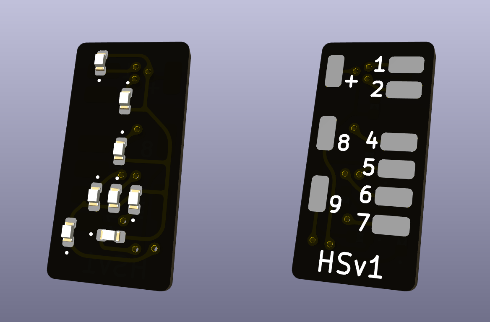

# Hauptsignal HSv1

Geeignet für KS-Hauptsignal.

## Anschlussbelegung

| Schema                | Pin-Belegung                    |
| --------------------- | ------------------------------- |
|  |  |

| Referenz | Pin | LED      | Funktion          |
| -------- | --- | -------- | ----------------- |
| J0       | +   |          | Versorgung (Vcc)  |
| J1       | 1   | Kaltweiß | Kennlicht         |
| J2       | 2   | Rot      | Halt              |
| J4       | 4   | Grün     | Fahrt             |
| J5       | 5   | Gelb     | Zs7 (linke LED)   |
| J6       | 6   | Kaltweiß | Ra (mittlere LED) |
| J7       | 7   | Gelb     | Zs7 (rechte LED)  |
| J8       | 8   | Gelb     | Zs7 (untere LED)  |
| J9       | 9   | Kaltweiß | Ra oder Zs1       |
