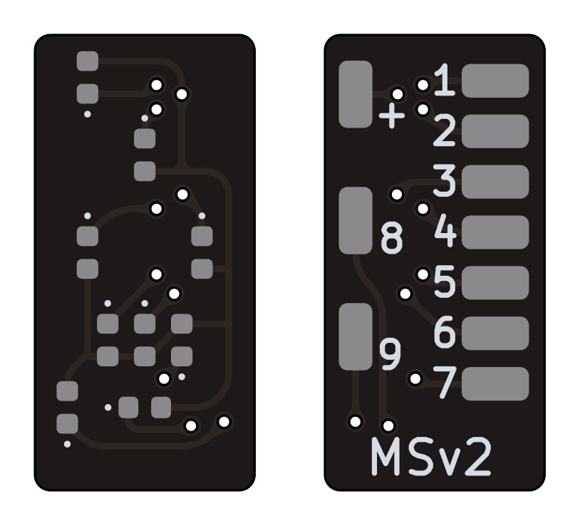
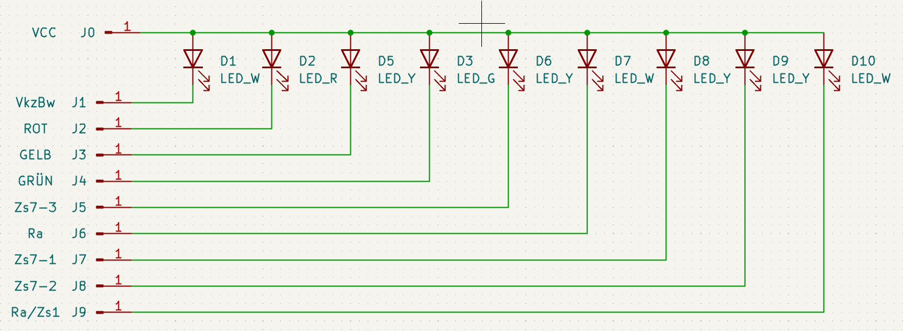
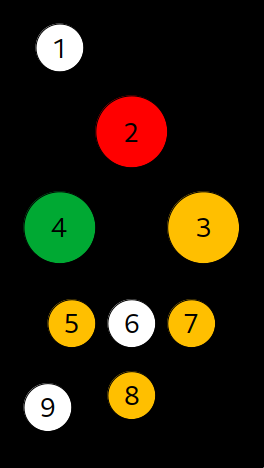

# Mehrabschnittssignal MSv2

Geeignet für KS-Mehrabschnittssignale.

## Anschlussbelegung

| Schema                | Pin-Belegung                    |
| --------------------- | ------------------------------- |
|  |  |

| Referenz | Pin | LED      | Funktion                         |
| -------- | --- | -------- | -------------------------------- |
| J0       | +   |          | Stromversorgung (+)              |
| J1       | 1   | Kaltweiß | Zusatzlicht (oben)               |
| J2       | 2   | Rot      | Hp0 (Halt)                       |
| J3       | 3   | Gelb     | Ks2 (Halt erwarten)              |
| J4       | 4   | Grün     | Ks1 (Fahrt erwarten)             |
| J5       | 5   | Gelb     | Zs7                              |
| J6       | 6   | Kaltweiß | Sh1/Ra12                         |
| J7       | 7   | Gelb     | Zs7                              |
| J8       | 8   | Gelb     | Zs7                              |
| J9       | 9   | Kaltweiß | Sh1/Ra12/Zs1/Zusatzlicht (unten) |

## License

This work is licensed under a
[Creative Commons Attribution-ShareAlike 4.0 International License](http://creativecommons.org/licenses/by-sa/4.0/).

