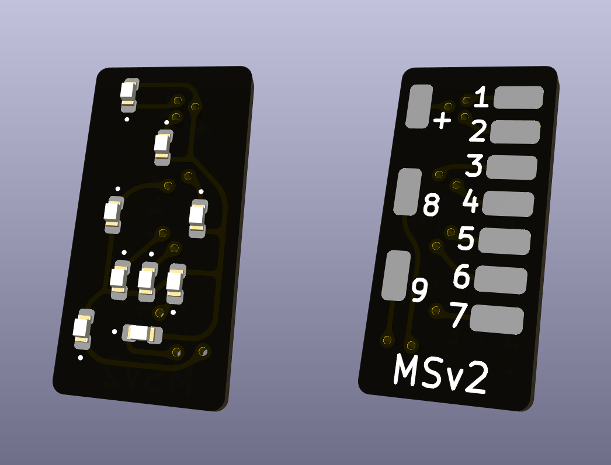

# Mehrabschnittssignal MSv2

Geeignet für Mehrabschnittssignale.

## Anschlussbelegung

| Schema                | Pin-Belegung                    |
| --------------------- | ------------------------------- |
|  |  |

| Referenz | Pin | LED      | Funktion                             |
| -------- | --- | -------- | ------------------------------------ |
| J0       | +   |          | Versorgung (Vcc)                     |
| J1       | 1   | Kaltweiß | Kennlicht/Verkürzter Bremswegabstand |
| J2       | 2   | Rot      | Halt                                 |
| J3       | 3   | Gelb     | Fahrt und Halt erwarten              |
| J4       | 4   | Grün     | Fahrt und Fahrt erwarten             |
| J5       | 5   | Gelb     | Zs7 (linke LED)                      |
| J6       | 6   | Kaltweiß | Ra (mittlere LED)                    |
| J7       | 7   | Gelb     | Zs7 (rechte LED)                     |
| J8       | 8   | Gelb     | Zs7 (untere LED)                     |
| J9       | 9   | Kaltweiß | Ra oder Zs1                          |
