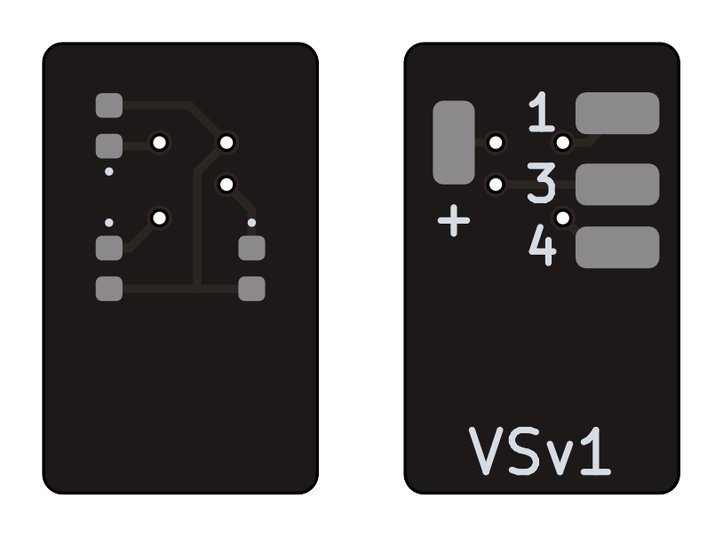
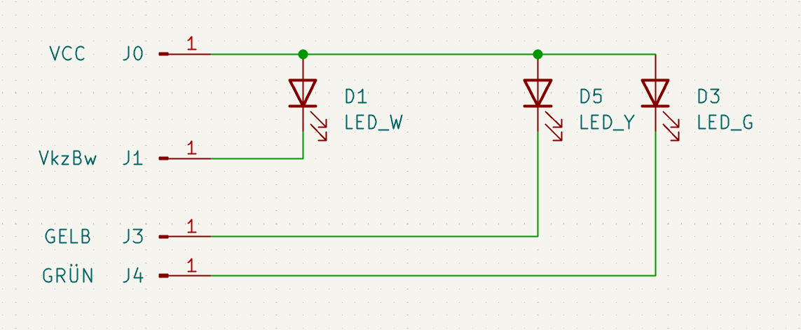
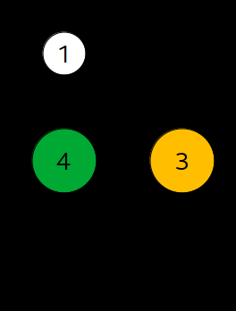

# Vorsignal VSv1

Geeignet für KS-Vorsignale.

## Anschlussbelegung

| Schema                | Pin-Belegung                    |
| --------------------- | ------------------------------- |
|  |  |

| Referenz | Pin | LED      | Funktion                          |
| -------- | --- | -------- | --------------------------------- |
| J0       | +   |          | Stromversorgung (+)               |
| J1       | 1   | Kaltweiß | Verkürzter Bremswegabstand (oben) |
| J3       | 3   | Gelb     | Ks2 (Halt erwarten)               |
| J4       | 4   | Grün     | Ks1 (Fahrt erwarten)              |
