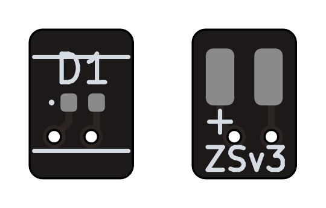

# Zusatzsignal ZSv2

Geeignet für Zusatzsignale über oder unter dem Signalschirm.

## Anschlussbelegung

| Referenz | Pin | LED | Funktion            |
| -------- | --- | --- | ------------------- |
|          | +   |     | Stromversorgung (+) |
|          |     |     | Masse               |
