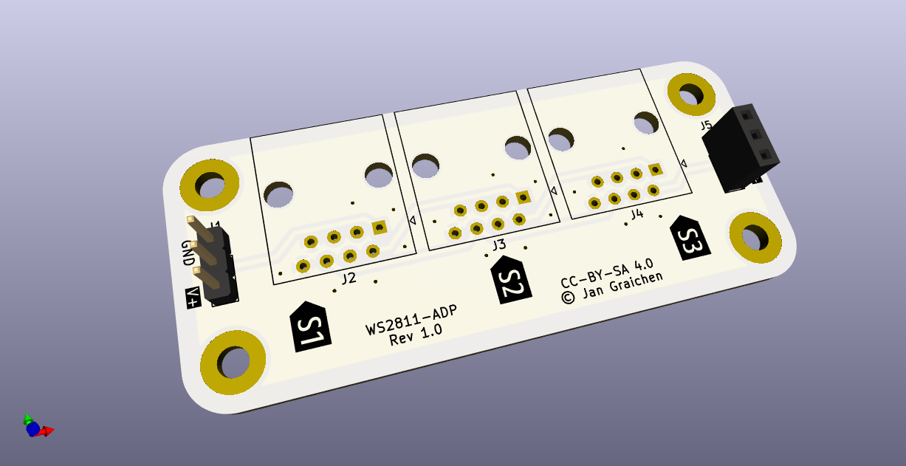
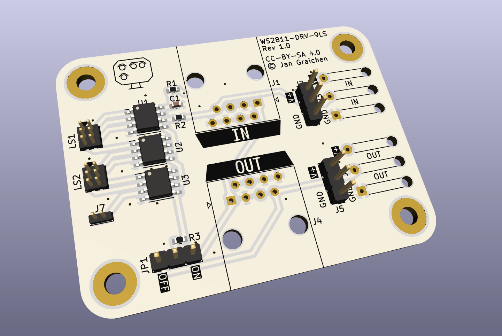

# Extra components

## WS2811 Adapter Board

An adapter boards to connect MGP signal decoders with driver boards via RJ45 cables, for longer distances and easier cabling.

Supports bypassing ports and looping back the digital signal to organize and optimize LED ordering. See the [board README](ws2811-adapter/README.md) for more details.

## WS2811 Driver 12 (1 Signal)

[LED driver board providing 12 LEDs](ws2811-driver-12/), intended for up to one fully equipped German KS signal. Can be mounted in a [Wattenscheider Schacht](../../freecad/watti-signal-mount/).

## WS2811 Driver 24 (2 Signals)

A [24 LED driver board](ws2811-driver-24/) for up to two fully equipped German KS signal, usually mounted on a signal gantry. Can be mounted in a [Wattenscheider Schacht](../../freecad/watti-signal-mount/).

## WS2811 Driver 6LS (1 LS)

This [driver board](ws2811-driver-6ls/) offers one tiny 2x3p 1 mm pitch connector for light shunting signals. The board can be mounted below the track, with the signal being mounted and connected through a 5 mm brass pole.

## WS2811 Driver 9LS (2 LS)

This [driver board](ws2811-driver-9ls/) offers two tiny 2x3p 1 mm pitch connectors for light shunting signals. The board can be mounted below the track, with the signal being mounted and connected through a 5 mm brass pole.

## License

See individual components. Otherwise, all components and parts are licensed under a [Creative Commons Attribution-ShareAlike 4.0 International License](http://creativecommons.org/licenses/by-sa/4.0/).

