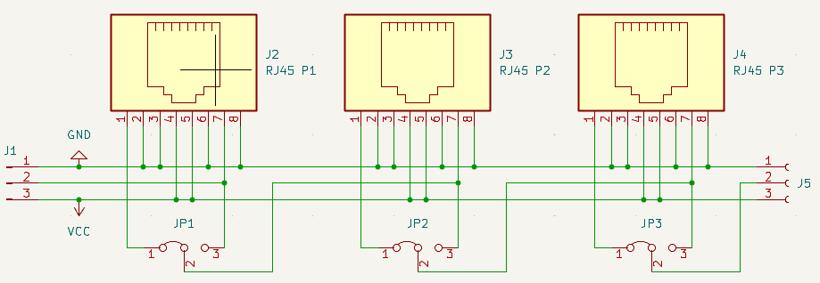
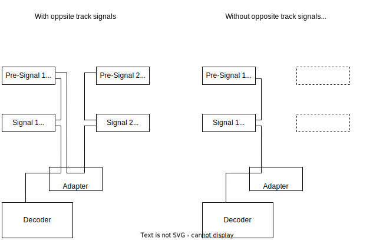

# WS2811 Adapter

Adapter PCB to connect Watti LED driver boards via RJ45 cables to [MGP signal decoders](http://www.mollehem.se/index.php/en/signals/signal-decoders/signaldecoder-de10-detail). The adapter board supports connecting multiple RJ45 loops in a chain.

## Schema

The control signal from the signal decoder consists of three wires, a ground and power line, and a single data wire. The signals are passed on to the RJ45 cables:

| RJ45 | Purpose              |
| ---- | -------------------- |
| 1    | Outgoing data signal |
| 2    | Returned data signal |
| 3    | Not connected        |
| 4    | VCC (Power)          |
| 5    | VCC (Power)          |
| 6    | Not connected        |
| 7    | GND                  |
| 8    | GND                  |

### Outgoing and returned data signal

LED on driver boards are controlled by the physical ordering on the data signal line. To order signals in a specific ordering, the RJ45 pinout supports returning the data signal from one RJ45 cable and pass it to the next. The last Watti LED driver must have the jumper JR1 set to "ON", to return the data signal line to the adapter board.

This allows ordering signals a convenient way for programming. For example, assume you want to program a single decoder to control the entry signal and pre-signal, and optional the entry signal and pre-signal for the opposite track.

If you connect the signals via a single RJ45 line with short distance, you might want to connect them in this order:

| Index | Signal                            | Logical LED numbers |
| ----- | --------------------------------- | ------------------- |
| 1     | Entry signal                      | LED 1-12            |
| 2     | Entry signal (opposite track)     | LED 13-24           |
| 3     | Pre-entry signal                  | LED 25-36           |
| 4     | Pre-entry signal (opposite track) | LED 37-48           |

If you now want to change your module layout to a setup without opposite track signals, the logical LED numbers programmed into the decoder wouldn't match the pre-entry signal for the regular track anymore.

| Index | Signal           | Logical LED numbers |
| ----- | ---------------- | ------------------- |
| 1     | Entry signal     | LED 1-12            |
| 2     | Pre-entry signal | LED 25-36 ⚠         |

To support such reconfiguration without reprogramming, the data signal can be routed differently:

