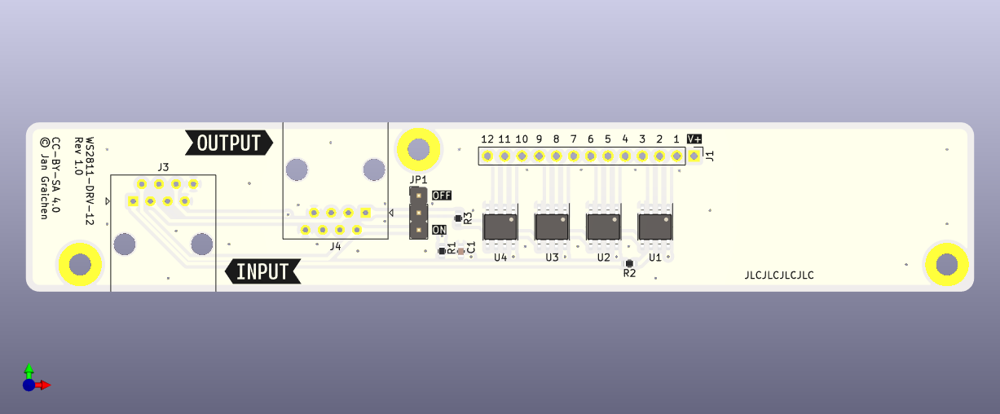

# WS2811 LED Driver 12

A WS2811 LED driver board compatible with [MGP signal decoders](http://www.mollehem.se/index.php/en/signals/signal-decoders/signaldecoder-de10-detail) and the [Wattenscheider signal mount](https://www.fremo-net.eu/index.php?id=339).

This LED driver board provides 12 LEDs, intended for up to one fully equipped German KS signal.

## Notes

1. Connect the RJ45 cable from the adapter board to the RJ45 plug labeled "INPUT".
2. Connect the RJ45 cable to the next signal from the "OUTPUT" plug.
3. If you do not connect an outgoing RJ45 cable, you can set the jumper JP1 to "ON" to route the data signal back to the adapter board. See more at the [adapter board README](../ws2811-adapter/README.md).

## License

This work is licensed under a
[Creative Commons Attribution-ShareAlike 4.0 International License](http://creativecommons.org/licenses/by-sa/4.0/).

