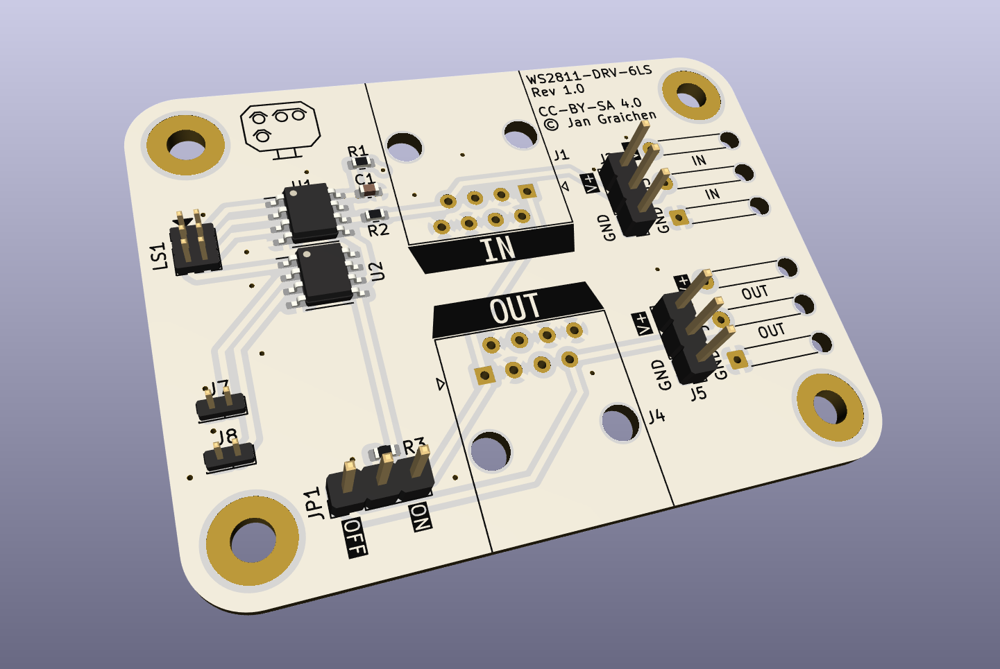

# WS2811 LED Driver 6LS

A WS2811 LED driver board compatible with [MGP signal decoders](http://www.mollehem.se/index.php/en/signals/signal-decoders/signaldecoder-de10-detail) and the [Wattenscheider signal mount](https://www.fremo-net.eu/index.php?id=339).

This LED driver board provides 4 LEDs via one 2x3p 1.27 mm pitch connectors, intended for one German light switching signals.

## Notes

This board can be connected via three methods:

1. RJ45 cabling as used by signal mount drivers and described in the [adapter board README](../ws2811-adapter/README.md).
2. Regular three-pin headers or servo connectors via J2 and J5.
3. Soldered wires via J3 and J6.

## Pinout

The 2x3 1.27mm pitch connectors have the following pinout:

| LED | Pin | Notes                   |
| --- | --- | ----------------------- |
|     | 1   | Vcc                     |
| 1   | 2   | Red 1 (LS-alt)          |
| 2   | 4   | White 1                 |
| 3   | 6   | Red 2 (LS-alt / LS-neu) |
| 4   | 5   | White 2                 |

## License

This work is licensed under a
[Creative Commons Attribution-ShareAlike 4.0 International License](http://creativecommons.org/licenses/by-sa/4.0/).

